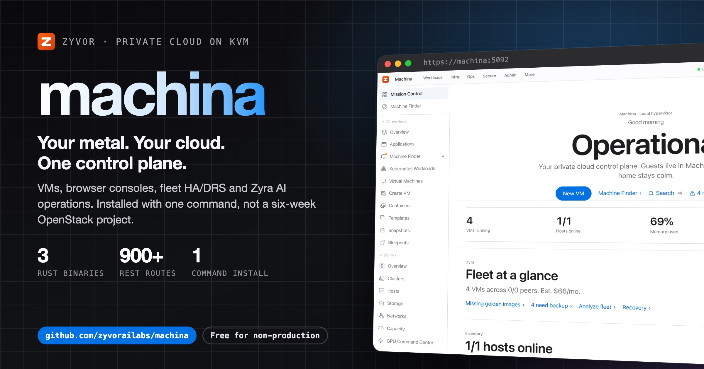
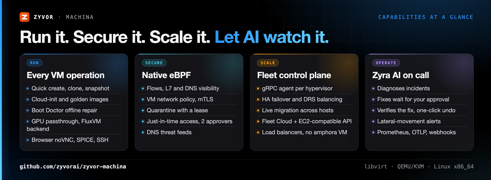
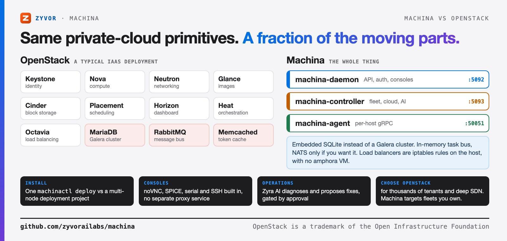
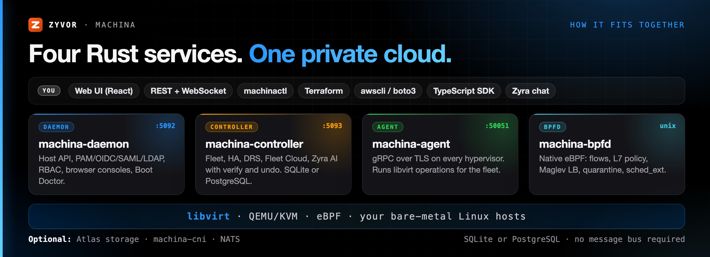

<div align="center">

# Machina

[](https://github.com/zyvorai/zyvor-machina/actions/workflows/ci.yml)
[](LICENSE)
[](Cargo.toml)
[](docs/README.md)
[](https://zyvorai.github.io/zyvor-machina/)

[](https://zyvor.dev/schedule?utm_source=github&utm_medium=machina&utm_campaign=readme_hero)
[](https://zyvor.dev/poc?utm_source=github&utm_medium=machina&utm_campaign=readme_hero)
[](#quickstart)



### Your metal. Your cloud. One control plane.

**The private cloud you can install before lunch.** VMs, browser consoles, fleet HA/DRS, an OpenStack-style self-service cloud, a native eBPF datapath and AI operations, from a handful of Rust services on plain Linux + KVM.

**One-command install** · **No SQL cluster, no message queue** · **Consoles built in** · **eBPF networking built in** · **AI that asks before it acts**

</div>

---

## What's new

**EC2-style Fleet Cloud.** Launch several instances at once with a key pair and first-boot user data, tag everything,
firewall with **enforced security groups whose status tells the truth**, attach volumes with live I/O limits, scale groups from
alarms, give a team a project-scoped API key, and drive it all from `awscli` or boto3 against the built-in EC2-compatible endpoint.
Start with the [tutorials](docs/tutorials/README.md); every feature has a [guide](docs/guides/README.md), and
[what is proven on a real host and what is not](docs/claims.md) is written down.

VPC foundations and elastic compute are available as a first host-local backend.
See [the operator guide](docs/cloud-vpc-elastic-compute.md) for isolation, deployment,
CPU scaling, and the explicit routing/peering limitations.

| | |
|---|---|
| **Scale to zero** | Idle VMs sleep (memory saved to disk, RAM handed back to the host) and wake on the first packet sent to them. [How →](docs/fleet-cloud-features.md#scale-to-zero) |
| **Time travel** | Fork a running VM in seconds, with or without its RAM; scheduled restore points and one-click rewind. [How →](docs/fleet-cloud-features.md#time-travel) |
| **Stacks you describe** | Say what you want in a sentence; get a template, a dry run (quota, placement, cost, policy replay), an approval, then a stack that heals its own drift. [How →](docs/fleet-cloud-features.md#stacks-you-describe) |
| **Autopilot capacity** | Instance groups scale ahead of the daily or weekly rush, drain from their load balancer, and sleep instead of stopping; VMs are right-sized from their own history and hosts consolidated, each through an approval you can undo. [How →](docs/fleet-cloud-features.md#autopilot-capacity) |
| **Game days** | Inject latency, loss, partitions, slow disks and crashes into your own VMs under a lease; health probes abort the run and lift every fault when the service suffers; a report per step. [How →](docs/fleet-cloud-features.md#game-days) |
| **Preemptible instances** | VMs that can wait give way when a host runs short of memory: saved to disk instead of stopped, back by themselves, lowest priority first, when there is room. [How →](docs/fleet-cloud-features.md#preemptible-instances) |
| **Boot Doctor** | A VM that won't boot gets diagnosed and repaired offline through GuestKit, with a backup taken first. |
| **VM quarantine** | Isolate a suspect VM in the eBPF datapath under a time-boxed lease that lapses on its own. |
| **Just-in-time access** | Open a VM's network for a set time, with two-person approval and automatic expiry. |
| **Zyra verify and undo** | Every AI action is checked afterwards ("did it work?") and can be rolled back in one click. |
| **VM flow history** | Service map, learn and replay of VM traffic, with lateral-movement alerts. |
| **DNS threat feeds** | VM network policy blocks known-bad domains from threat feeds. |
| **Plain-English policies** | Describe a VM network policy in words; Zyvor drafts the YAML, dry-runs it against past traffic and applies it after approval. |
| **Project isolation** | Fleet Cloud projects are isolated from each other by default, with per-project egress allowlists and egress IPs that Machina adds to the host and announces itself. |
| **Encrypted cross-host overlay** | WireGuard between hypervisors; VM traffic keeps its identity across hosts, so isolation holds even on NAT networks. |
| **Segmentation evidence** | Export a sealed (SHA-256) JSON or Markdown report of policies, the reachability matrix and denied traffic for audits. |
| **Quick create and Fix-it** | Image, size, Create; then a one-click Fix-it list (guest agent, backups) in Command Center. |

---

## Why Machina

| When this happens… | Machina gives you… |
|---|---|
| You want a private cloud, but OpenStack is a six-week project and a full-time team | `./machinactl deploy`: a few Rust services, embedded SQLite, a browser UI on `:5092` minutes later |
| VMware renewal quotes keep climbing | Open KVM/libvirt underneath, with HA failover, DRS and live migration on top |
| libvirt ops live in a pile of `virsh` scripts | One dashboard, a REST API with 1,000+ routes, a CLI and a Terraform provider over the same model |
| Every console needs its own gateway | noVNC, SPICE, serial and SSH proxied by the daemon, with RBAC and audit |
| Networking means Cilium + Tetragon + kube-proxy + a firewall agent | One eBPF service, `machina-bpfd`: load balancing, DDoS shield, VM isolation, flow visibility |
| On-call means triaging the same incidents at 3 a.m. | Zyra AI diagnoses, correlates and proposes the fix, then waits for a human approval |

**Evaluating?** [Why Machina](docs/buyers/why-machina.md) (five minutes) · [Alternatives](docs/buyers/machina-vs-alternatives.md) · [Security and compliance](docs/buyers/security-and-compliance.md) · [30-day evaluation plan](docs/buyers/evaluation-guide.md). **Using it?** [Tutorials](docs/tutorials/README.md) · [Cookbook](docs/users/cookbook.md).



---

## Machina vs OpenStack



| | **Machina** | **OpenStack** (typical IaaS) |
|---|---|---|
| Services to run | **4** Rust services | 9+ services (Keystone, Nova, Neutron, Glance, Cinder, Placement, Horizon, Heat, Octavia) |
| Backing infrastructure | Embedded SQLite; optional NATS | MariaDB/Galera, RabbitMQ, Memcached |
| Install | `./machinactl deploy` | Kolla-Ansible / OpenStack-Ansible project |
| Smallest useful footprint | A single KVM host | A multi-node control plane |
| Flavors, images, volumes, SGs, stacks, LBs | Yes, in [Fleet Cloud](docs/customer/pages/fleet-cloud/fleet-cloud.md) | Yes, across six projects |
| Load balancer data plane | On the host, no amphora VM: iptables rules for Fleet Cloud, eBPF Maglev for Kubernetes services | Amphora VMs (Octavia) |
| Network datapath | Native eBPF, lease-gated enforcement | Neutron agents + OVS/OVN |
| Browser consoles | Built into the daemon | noVNC/SPICE proxy services |
| HA failover and DRS | Built in ([controller HA](docs/controller-ha.md)) | Masakari + Watcher (separate projects) |
| AI operations | Zyra AI, approval-gated | Not included |
| Idle VMs | [Scale to zero](docs/fleet-cloud-features.md#scale-to-zero): sleep when idle, wake on the first packet | Shelve and unshelve by hand |
| Copies and rollback | [Time travel](docs/fleet-cloud-features.md#time-travel): live fork (optionally with RAM), restore points, rewind in place | Snapshot uploads a full image to Glance; rebuild from it |
| Orchestration | [Stacks](docs/fleet-cloud-features.md#stacks-you-describe) drafted from a description, dry-run with cost and policy replay, approved, then kept in sync every minute | Heat: hand-written HOT templates; no drift repair |
| Autoscaling and sizing | [Autopilot](docs/fleet-cloud-features.md#autopilot-capacity): seasonal forecast pre-scaling, load-balancer drain, sleep on scale-in, history-based rightsizing and host consolidation with approval and undo | Senlin/Heat alarms react after the fact; Watcher is a separate service; resizes by hand |
| Resilience testing | [Game days](docs/fleet-cloud-features.md#game-days): leased network, disk and crash faults with health-probe abort and a report | Not included; a separate chaos tool |
| Spare capacity | [Preemptible instances](docs/fleet-cloud-features.md#preemptible-instances): saved to disk under memory pressure by priority and restored automatically | Not included; spot capacity deletes the instance |
| Containers and Kubernetes | Podman, KubeVirt | Zun / Magnum (separate projects) |
| **Choose OpenStack when** | | You run thousands of tenants, need Neutron-grade SDN breadth, or depend on its ecosystem |

Machina targets the fleets you own: a lab, a branch, a sovereign region, a VMware exit. It deliberately trades OpenStack's hyperscale multi-tenancy for a cloud one person can install, understand and upgrade.

---

## See it live

Captured from a real deployment on Ubuntu 26.04 in the dark theme, not mockups.


### Every VM operation, in one place

Create, clone, snapshot, back up and migrate. Cloud-init, GPU and PCI passthrough, golden images built with Packer (Linux, plus Windows 10/11 through dockur when enabled), networks, storage pools and nwfilters. [VM guide →](docs/customer/pages/core/vms.md)


### Consoles in the browser, no gateway to deploy

noVNC, SPICE, serial and SSH are proxied by `machina-daemon` itself, behind the same RBAC and audit log as everything else. VM detail leads with a live console preview. [Console architecture →](docs/consolehub-architecture.md)

### A fleet, not a host

Add hypervisors with a gRPC agent over TLS. The controller keeps desired state, fails VMs over when a host dies, balances load with DRS and live-migrates between hosts. [Controller HA and DRS →](docs/controller-ha.md)

### Fleet Cloud: self-service like a public cloud

Flavors, images, instances, volumes and snapshots, security groups, keypairs, floating IPs, server groups, Heat-style stacks, projects and load balancers, all native controller APIs. Beyond that, idle instances can scale to zero and wake on traffic. EC2-style semantics on top: tags and ids, instance types, user data, enforced security groups, Elastic IPs and a NAT gateway, an instance metadata service, alarms with scaling actions, project-scoped API keys, and an EC2-compatible endpoint (`aws`/boto3 work with an endpoint override). [EC2 semantics →](docs/cloud-ec2-semantics.md) · [EC2 API →](docs/cloud-ec2-api.md) [Fleet Cloud →](docs/customer/pages/fleet-cloud/fleet-cloud.md) · [Features OpenStack doesn't have →](docs/fleet-cloud-features.md)


### Zyra AI: an operator that asks first

Autonomous diagnostics across the fleet, incident correlation, rightsizing and natural-language operations, with bring-your-own LLM providers (keys encrypted at rest) and an approval queue in front of every change. [Zyra AI →](docs/customer/pages/platform-security/platform-zyra.md)


### Networking and security, in the kernel

Machina ships its own eBPF datapath instead of bolting on Cilium, Tetragon or a separate firewall agent. One root service, `machina-bpfd`, provides:

- **Load balancing**: Maglev service LB for Kubernetes (socket-level, NodePort at TC or XDP, DSR) and QUIC-LB at XDP.
- **Kubernetes CNI** (opt-in): `machina-cni` replaces flannel and kube-proxy where you choose it, with NetworkPolicy and Cilium policy migration. It never takes over an existing CNI.
- **VM network policy**: which VM may talk to which, ingress and egress, written as CiliumNetworkPolicy YAML and enforced on each VM tap without Cilium or Envoy. This covers L3/L4, DNS names (`toFQDNs`), L7 (HTTP, gRPC, Kafka, TLS SNI, DNS), TLS interception with header rewrites, CIDR groups and mutual authentication (mTLS between hosts). Comes with policy trace and Hubble-style flows in the UI and in `machinactl netpol` / `machinactl flow`, plus flow history (service map, learn, replay, L7 metrics), quarantine, just-in-time access, lateral-movement alerts, DNS threat feeds, plain-English policies, project isolation, egress allowlists and IPs (added to the host and announced by Machina), an encrypted WireGuard overlay that keeps VM identity across hosts, VM addresses found without a guest agent (neighbour tables and tap traffic), and segmentation evidence export.
- **Protection**: XDP DDoS shield, emergency node isolation, VM edge isolation and rate limits, a QEMU sandbox and a BPF-LSM guard around the VMM.
- **Visibility**: flows, DNS, L7 (HTTP, TLS SNI, gRPC, Redis, PostgreSQL, MySQL, Kafka), JA3/JA4 fingerprints, network-change audit and per-VM runtime histograms.
- **Inside guests**: per-container network and LSM policy through GuestKit, from the VM's **Guest policy** tab.

Everything that can drop traffic starts in observe mode and enforces only under a time-boxed lease that the kernel honours on its own; nothing is persisted. [Native eBPF →](docs/ebpf/README.md)


### And the rest of the platform

- **Identity and access**: PAM, OIDC, SAML and [LDAP](docs/ldap-auth.md) sign-in, role-based access, a full audit trail. [Admin guide →](docs/handbook/admin-configuration.md)
- **Containers**: local Podman/Docker containers and Podman pods next to your VMs. [Containers →](docs/customer/pages/infrastructure/containers.md)
- **Kubernetes**: KubeVirt inventory and a documented migration path. [KubeVirt →](docs/kubevirt-migration.md)
- **FluxVM**: QEMU, Cloud Hypervisor, Firecracker and flux-vm VMs from FluxVM next to libvirt VMs, with snapshots, backups, hot-add, install ISOs, live migration and fleet HA. [FluxVM →](docs/fluxvm.md)
- **Observability**: Prometheus metrics, OTLP export, PSI/cgroup pressure, alerts and webhooks. [Observability →](docs/guides/observability.md)
- **Storage**: Atlas integration puts VM disks on Ceph RBD, NFS or ZFS volumes with snapshot, backup and restore. [Atlas →](docs/atlas-storage.md)
- **Automation**: [Terraform provider](terraform/machina/README.md), [TypeScript SDK](sdk/typescript/README.md), OpenAPI spec, `machinactl`.

---

## How it fits together



| Component | Port | Role |
|---|---|---|
| `machina-daemon` | `:5092` | Single-host API, auth/RBAC, console proxies, web UI |
| `machina-controller` | `:5093` | Fleet, HA, DRS, Fleet Cloud, Zyra AI (embedded SQLite) |
| `machina-agent` | `:50051`, `:50052` | Per-host gRPC agent (TLS) for libvirt and eBPF ops; `:50052` is its console proxy |
| `machina-bpfd` | unix socket | Root eBPF datapath, telemetry and enforcement (`/api/v1/bpf/*`) |
| `machina-cni` | — | Opt-in Kubernetes CNI plugin and node agent |
| `machina-scx` | — | Optional sched_ext VM scheduler (kernel 6.12+) |

The daemon alone is a complete single-host manager. Add the controller and an agent per host for a fleet; `machina-bpfd` runs on every host that should get the eBPF datapath.

---

## Quickstart

On any Linux host with KVM (Ubuntu, Debian, Fedora, RHEL/Alma/Rocky, openSUSE, Arch):

```bash
git clone https://github.com/zyvorai/zyvor-machina.git machina && cd machina
./machinactl deploy        # deps · build · install · start · verify
# open https://<host>:5092 and sign in with a local (PAM) account
# (package installs create an admin user instead: sudo machinactl show-login prints it)
```

From your laptop to a remote host (sources are rsync'd and built on the server; nothing compiles locally):

```bash
./scripts/deploy-remote.sh user@host                  # build + install daemon and web UI on the server
./scripts/deploy-remote.sh user@host --platform       # plus controller and agent
./scripts/deploy-remote.sh user@host --remote-build   # compile only, no install (fast build check)
```

### Requirements

- 64-bit Linux (x86_64 or aarch64) with VT-x/AMD-V, so `/dev/kvm` exists, and libvirt.
- Ubuntu, Debian, Fedora, RHEL/Alma/Rocky, openSUSE or Arch.
- Native eBPF: kernel with BTF and cgroup v2; 6.6+ for TCX attach, BPF-LSM (`lsm=...,bpf`) for VMM guard enforcement, 6.12+ for the sched_ext scheduler. `GET /api/v1/bpf/status` shows what your kernel supports.
- Ports: `5092` (daemon, web UI), `5093` (controller), `50051`/`50052` (agent). [Full port list →](docs/handbook/README.md#ports)
- Any current browser; consoles need no plugins.

| Next step | Where |
|---|---|
| One copy-paste path: controller, node, VM, backup | [Quickstart](docs/QUICKSTART.md) |
| First login and workflows | [Getting started](docs/customer/getting-started.md) |
| Every screen, explained | [Page-by-page guides](docs/customer/pages/README.md) |
| Ports, auth, TLS, config | [Admin configuration](docs/handbook/admin-configuration.md) |
| Production pilot checklist | [Customer site readiness](docs/CUSTOMER_SITE_READINESS.md) |
| Contributor setup | [Engineering onboarding](docs/ENGINEERING_ONBOARDING.md) |
| Everything else | [Docs index](docs/README.md) · [Website](https://zyvorai.github.io/zyvor-machina/) |

---

## Maturity

| Area | Status |
|---|---|
| VMs, storage, networks, consoles, auth, audit | Stable |
| Fleet, HA with fencing, DRS, live migration | Stable |
| Fleet Cloud | Stable |
| eBPF observability | Preview |
| eBPF enforcement | Preview, lease-gated |
| `machina-cni` | Preview, opt-in |
| QUIC-LB, AF_XDP, sched_ext, guest policy | Opt-in |
| Zyra AI | Stable, approval-gated |
| Atlas storage integration | Opt-in (`ATLAS_ENABLED=1`) |

---

## Develop

The Rust workspace needs Linux libvirt headers; build on Linux (or use `deploy-remote.sh --remote-build` from a Mac). The web UI builds anywhere.

```bash
make build && make test && make lint       # Rust workspace (Linux)
make bpf-deps                              # eBPF toolchain: nightly + bpf-linker
sudo make bpf-test                         # eBPF netns smoke (veths only)
cd web && npm install && npm run dev       # UI on :3000, proxied to a daemon on :5092
cd web && npm test && npm run build        # vitest + typecheck + bundle
```

Start with [Engineering onboarding](docs/ENGINEERING_ONBOARDING.md); architecture and conventions are in [CLAUDE.md](CLAUDE.md).

---

## Part of the Zyvor stack

| Product | Role |
|---|---|
| **Machina** | Private cloud on KVM: VMs, fleet, Fleet Cloud, native eBPF, Zyra AI |
| **Atlas** | Storage control plane (Ceph/NFS/ZFS) for VM disks, snapshots, backups |
| **GuestKit** | In-guest agent, offline inspection, per-container eBPF policy |
| **hyper2kvm** | VM migration into KVM |

→ [zyvor.dev](https://zyvor.dev)

---

## License

Machina is source-available under the **[Zyvor Production License v1.0](LICENSE)** (SPDX `LicenseRef-Zyvor-Production-1.0`).

- **Free** for evaluation, development, testing, research, education, homelabs and all other non-production use.
- **Production use** requires an annual enterprise subscription. Plans, support levels and terms: [SUBSCRIPTION-MODEL.md](docs/SUBSCRIPTION-MODEL.md) · [licensing model](docs/legal/LICENSING-MODEL.md).

Contributions are welcome under the same license; see [CONTRIBUTING.md](CONTRIBUTING.md). Report vulnerabilities privately per [SECURITY.md](SECURITY.md).

---

<div align="center">

### Ready to run your own cloud?

[](https://zyvor.dev/schedule?utm_source=github&utm_medium=machina&utm_campaign=readme_footer)
[](https://zyvor.dev/poc?utm_source=github&utm_medium=machina&utm_campaign=readme_footer)
[](https://github.com/zyvorai/zyvor-machina)

</div>
