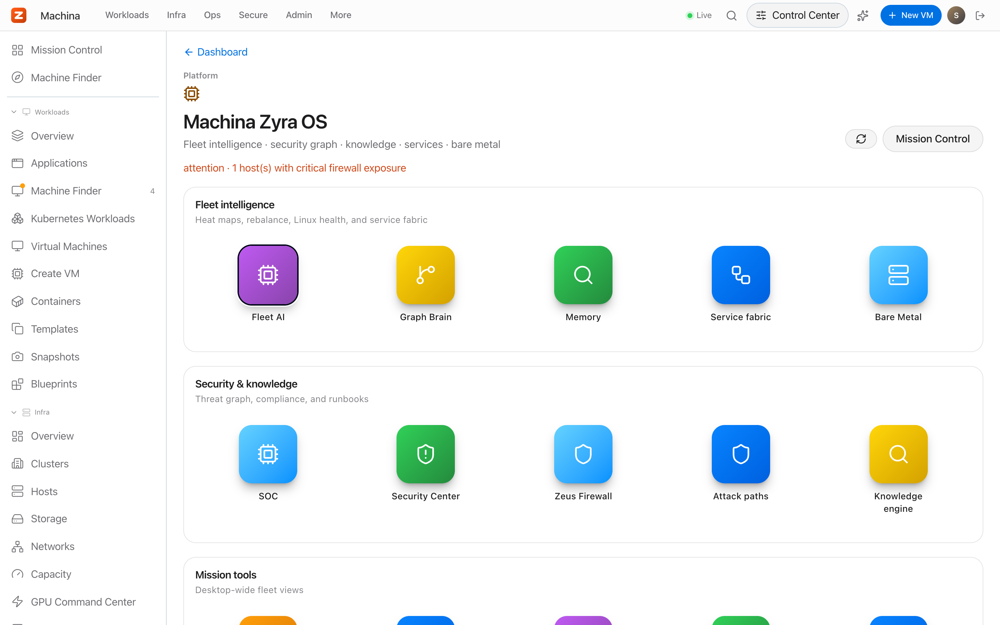

<div align="center">

# Machina

[](https://github.com/zyvorailabs/machina/actions/workflows/ci.yml)
[](LICENSE)
[](Cargo.toml)
[](docs/README.md)

[](https://zyvor.dev/schedule?utm_source=github&utm_medium=machina&utm_campaign=readme_hero)
[](https://zyvor.dev/poc?utm_source=github&utm_medium=machina&utm_campaign=readme_hero)
[](#quickstart)


### Your metal. Your cloud. One control plane.

**The private cloud you can install before lunch.** VMs, browser consoles, fleet HA/DRS, an OpenStack-style self-service cloud and AI operations, from three Rust binaries on plain Linux + KVM.

**One-command install** · **No SQL cluster, no message queue** · **Consoles built in** · **AI that asks before it acts**

</div>

---

## Why Machina

| When this happens… | Machina gives you… |
|---|---|
| You want a private cloud, but OpenStack is a six-week project and a full-time team | `./machinactl deploy`: three binaries, embedded SQLite, a browser UI on `:5092` minutes later |
| VMware renewal quotes keep climbing | Open KVM/libvirt underneath, with HA failover, DRS and live migration on top |
| libvirt ops live in a pile of `virsh` scripts | One dashboard, a REST API with 900+ routes, a CLI and a Terraform provider over the same model |
| Every console needs its own gateway | noVNC, SPICE, serial and SSH proxied by the daemon, with RBAC and audit |
| On-call means triaging the same incidents at 3 a.m. | Zyra AI diagnoses, correlates and proposes the fix, then waits for a human approval |


---

## Machina vs OpenStack


| | **Machina** | **OpenStack** (typical IaaS) |
|---|---|---|
| Services to run | **3** Rust binaries (daemon, controller, agent) | 9+ services (Keystone, Nova, Neutron, Glance, Cinder, Placement, Horizon, Heat, Octavia) |
| Backing infrastructure | Embedded SQLite; optional NATS | MariaDB/Galera, RabbitMQ, Memcached |
| Install | `./machinactl deploy` on one host, `deploy-remote.sh` for the next | Kolla-Ansible / OpenStack-Ansible deployment project |
| Smallest useful footprint | A single KVM host | A multi-node control plane |
| Flavors, images, volumes, security groups, stacks, load balancers | Yes, in [Fleet Cloud](docs/customer/pages/fleet-cloud/fleet-cloud.md) | Yes (Nova, Glance, Cinder, Neutron, Heat, Octavia) |
| Load balancer data plane | iptables rules pushed to the host, no amphora VM | Amphora VMs (Octavia) |
| Browser consoles | noVNC, SPICE, serial, SSH built into the daemon | noVNC/SPICE proxy services |
| HA failover and DRS | Built into the controller ([fleet HA](docs/fleet-ha.md)) | Separate projects: Masakari (instance HA), Watcher (rebalancing) |
| AI operations | Zyra AI: diagnostics, incidents, rightsizing, approvals | Not included |
| Containers and Kubernetes | Podman containers and pods, KubeVirt inventory and migration | Zun / Magnum (separate projects) |
| **Choose OpenStack when** | | You run thousands of tenants, need Neutron-grade SDN breadth, or depend on its ecosystem |

Machina targets the fleets you own: a lab, a branch, a sovereign region, a VMware exit. It deliberately trades OpenStack's hyperscale multi-tenancy for a cloud one person can install, understand and upgrade.

---

## See it live

Captured from a real deployment on Ubuntu 26.04, not mockups.


### Every VM operation, in one place

Create, clone, snapshot, back up and migrate. Cloud-init, GPU and PCI passthrough, golden images built with Packer (Linux, plus Windows 10/11 through dockur when enabled), networks, storage pools and nwfilters. [VM guide →](docs/customer/pages/core/vms.md)


### Consoles in the browser, no gateway to deploy

noVNC, SPICE, serial and SSH are proxied by `machina-daemon` itself, behind the same RBAC and audit log as everything else. VM detail leads with a live console preview. [Console architecture →](docs/consolehub-architecture.md)


### A fleet, not a host

Add hypervisors with a gRPC agent over TLS. The controller keeps desired state, fails VMs over when a host dies, balances load with DRS and live-migrates between hosts. [Fleet HA →](docs/fleet-ha.md)


### Fleet Cloud: self-service like a public cloud

Flavors, images, instances, volumes and snapshots, security groups, keypairs, floating IPs, server groups, Heat-style stacks, projects and load balancers, all native controller APIs. [Fleet Cloud →](docs/customer/pages/fleet-cloud/fleet-cloud.md)


### Zyra AI: an operator that asks first

Autonomous diagnostics across the fleet, incident correlation, rightsizing and natural-language operations, with bring-your-own LLM providers (keys encrypted at rest) and an approval queue in front of every change. [Zyra AI →](docs/customer/pages/platform-security/platform-zyra.md)



### And the rest of the platform

- **Identity and access**: PAM, OIDC, SAML and [LDAP](docs/ldap-auth.md) sign-in, role-based access, a full audit trail. [Admin guide →](docs/handbook/admin-configuration.md)
- **Containers**: local Podman/Docker containers and Podman pods next to your VMs. [Containers →](docs/customer/pages/infrastructure/containers.md)
- **Kubernetes**: KubeVirt inventory and a documented migration path. [KubeVirt →](docs/kubevirt-migration.md)
- **Observability**: Prometheus metrics, OTLP export, PSI/cgroup pressure, alerts and webhooks. [Observability →](docs/guides/observability.md)
- **Storage**: Atlas integration puts VM disks on Ceph RBD, NFS or ZFS volumes with snapshot, backup and restore. [Atlas →](docs/atlas-storage.md)
- **Network security**: real kernel-level deny rules through [Netra](https://github.com/zyvorai/netra) eBPF, with leases that fail open, plus PacketWolf flow intelligence.
- **Automation**: [Terraform provider](terraform/machina/README.md), [TypeScript SDK](sdk/typescript/README.md), OpenAPI spec, `machinactl`.

---

## How it fits together


| Component | Port | Role |
|---|---|---|
| `machina-daemon` | `:5092` | Single-host REST + WebSocket API, PAM/OIDC/SAML/LDAP, RBAC, console proxies, serves the web UI |
| `machina-controller` | `:5093` | Multi-host control plane: fleet, HA, DRS, Fleet Cloud, Zyra AI. Embedded SQLite, optional NATS |
| `machina-agent` | `:50051` | Per-hypervisor gRPC agent (TLS) that executes libvirt operations for the controller |

---

## Quickstart

On any Linux host with KVM (Ubuntu, Debian, Fedora, RHEL/Alma/Rocky, openSUSE, Arch):

```bash
git clone https://github.com/zyvorailabs/machina.git && cd machina
./machinactl deploy        # deps · build · install · start · verify
# open https://<host>:5092 and sign in with a local (PAM) account
```

From your laptop to a remote host (sources are rsync'd and built on the server; nothing compiles locally):

```bash
./scripts/deploy-remote.sh HOST USER              # daemon + web UI
./scripts/deploy-remote.sh HOST USER --platform   # plus controller and agent
```

| Next step | Where |
|---|---|
| First login and workflows | [Getting started](docs/customer/getting-started.md) |
| Every screen, explained | [Page-by-page guides](docs/customer/pages/README.md) |
| Ports, auth, TLS, config | [Admin configuration](docs/handbook/admin-configuration.md) |
| Production pilot checklist | [Customer site readiness](docs/CUSTOMER_SITE_READINESS.md) |
| Contributor setup | [Engineering onboarding](docs/ENGINEERING_ONBOARDING.md) |
| Everything else | [Docs index](docs/README.md) |

---

## Part of the Zyvor stack

| Product | Role |
|---|---|
| **Machina** | Private cloud on KVM: VMs, fleet, Fleet Cloud, Zyra AI |
| **[Netra](https://github.com/zyvorai/netra)** | eBPF network observability and emergency control |
| **Atlas** | Storage control plane (Ceph/NFS/ZFS) for VM disks, snapshots, backups |
| **PacketWolf** | Kernel-native network intelligence |
| **GuestKit** | Offline VM migration assurance |
| **HyperSDK / hyper2kvm** | Multi-cloud VM migration into KVM |

→ [zyvor.dev](https://zyvor.dev)

---

## License

Machina is source-available under the **[Zyvor Production License v1.0](LICENSE)** (SPDX `LicenseRef-Zyvor-Production-1.0`).

- **Free** for evaluation, development, testing, research, education, homelabs and all other non-production use.
- **Production use** requires an annual enterprise subscription. Plans, support levels and terms: [SUBSCRIPTION-MODEL.md](docs/SUBSCRIPTION-MODEL.md) · [licensing model](docs/legal/LICENSING-MODEL.md).

Contributions are welcome under the same license; see [CONTRIBUTING.md](CONTRIBUTING.md). Report vulnerabilities privately per [SECURITY.md](SECURITY.md).

---

<div align="center">

### Ready to run your own cloud?

[](https://zyvor.dev/schedule?utm_source=github&utm_medium=machina&utm_campaign=readme_footer)
[](https://zyvor.dev/poc?utm_source=github&utm_medium=machina&utm_campaign=readme_footer)
[](https://github.com/zyvorailabs/machina)

</div>
