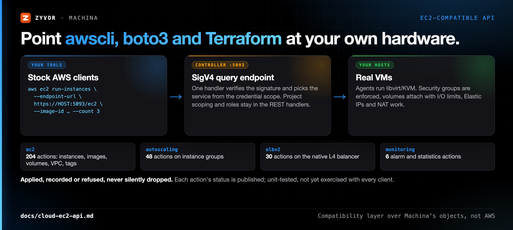

# EC2-compatible API

Machina's controller answers four AWS query services (EC2, Auto Scaling, ELBv2 and a CloudWatch-style alarm subset) with
form-encoded requests signed with AWS Signature Version 4, so the `aws` CLI, boto3 and Terraform's `aws` provider can be pointed
at it with an endpoint override. It is a compatibility layer over Machina's own objects, **not** AWS: every action is mapped
onto a REST handler or the engine behind it, and what Machina cannot do is refused by name (never accepted and ignored). The
tables below say which actions are real, merely recorded, stored plans or refused.

How to drive it with stock clients (aws cli, boto3, Terraform, `run-compat.sh`) is in [cloud-ec2-clients.md](cloud-ec2-clients.md).
What each EC2 concept means on Machina is in [cloud-ec2-semantics.md](cloud-ec2-semantics.md).



**Quickstart.** Create an access key (below), then:

```bash
export AWS_ACCESS_KEY_ID=MCAK… AWS_SECRET_ACCESS_KEY=… AWS_DEFAULT_REGION=machina
aws --endpoint-url https://HOST:5093/ec2 --no-verify-ssl ec2 describe-images
aws --endpoint-url https://HOST:5093/ec2 --no-verify-ssl ec2 run-instances --image-id <ImageId> --count 3
```

## Endpoint and credentials
The endpoints live on the **controller** (`https://HOST:5093/ec2`, `/autoscaling`, `/elbv2`, `/monitoring`, each also with a
trailing slash). The daemon on `:5092` only reverse-proxies `/api/v1/platform/controller/...`, so these paths are not served there.
An admin creates an access key (the secret is shown once):

```bash
curl -sk -H "Authorization: Bearer $TOKEN" -X POST https://HOST:5093/api/v1/ec2/access-keys \
     -d '{"description":"ci"}' -H 'content-type: application/json'

export AWS_ACCESS_KEY_ID=MCAK… AWS_SECRET_ACCESS_KEY=… AWS_DEFAULT_REGION=machina
aws ec2 describe-instances --endpoint-url https://HOST:5093/ec2   # --no-verify-ssl for the self-signed certificate
```

The region in the credential scope is signed but not checked. A key carries the **role** of the admin who created it (not a project
scope: the project-scoped API keys of `docs/claims.md` C16 apply to the REST API and do not narrow what these actions return).
Revoke with `DELETE /api/v1/ec2/access-keys/{id}`.

## Services, scopes and aliases
One handler answers `POST /ec2`, `/monitoring`, `/autoscaling` and `/elbv2`. The path is only an alias: the service in the
signature's credential scope (`…/<region>/<service>/aws4_request`) decides the action table, the XML namespace, the API version and
the error shape, so a client may send every service to one `endpoint_url`. Any other scope gets `AuthFailure`.

| scope | path alias | actions | namespace / `Version` | errors |
|---|---|---|---|---|
| `ec2` | `/ec2` | the `ec2` table below (the six CloudWatch-style actions answer here too, for older clients) | `…/ec2…/2016-11-15/`; any `Version` is accepted | `<Response><Errors>` |
| `monitoring` | `/monitoring` | six alarm and statistics actions | `…/monitoring…/2010-08-01/` | `<ErrorResponse><Error><Type>Sender|Receiver…` |
| `autoscaling` | `/autoscaling` | the `autoscaling` table | `…/autoscaling…/2011-01-01/` | as `monitoring` |
| `elasticloadbalancing` | `/elbv2` | ELBv2 only; classic ELB (`Version` `2012-06-01`) is refused with `InvalidParameterValue` | `…/elasticloadbalancing…/2015-12-01/` | as `monitoring` |

A `Version` other than the service's own is `InvalidParameterValue` on every service except `ec2`. The `monitoring` answers are the
`ec2`-shaped bodies converted to CloudWatch's shape (PascalCase tags, `<member>` lists, ISO 8601 timestamps, no result element for
the write actions); only our unit tests have compared that shape with CloudWatch's, no boto3 cloudwatch client has parsed it.

## Security
- Requests older or newer than 15 minutes (`X-Amz-Date`) are refused (`RequestExpired`), and the signature is compared in constant time.
- Unknown, revoked and wrong-secret keys get the same `AuthFailure` answer.
- Start/stop and every other change need the operator or admin role; a handful of actions need admin (`FenceHost`, webhooks,
  `CreateProject`, resize/consolidation proposals, `DescribeAudit`).
- The secret has to be recoverable to verify signatures, so it is stored encrypted when `MACHINA_API_KEY_MASTER_KEY` is set and in
  plaintext otherwise: set the master key in production.
- The endpoint sits behind the same rate limit as login.

## Behaviour every client meets
**These four apply to the `ec2` service only.** `monitoring`, `autoscaling` and `elasticloadbalancing` have their own parameters
(`Marker`/`PageSize` on ELBv2, `NextToken`/`MaxRecords` on Auto Scaling) and do not honour `DryRun`, `ClientToken` or `Filter.N`.

- **`DryRun=true`** answers what the real call would, without doing it: `UnauthorizedOperation` when the key's role may not do it,
  otherwise `DryRunOperation` (HTTP 412, as AWS). Only the role is checked; parameters are validated by the real call.
- **`ClientToken`** on `RunInstances`, `CreateLaunchTemplate`, `CreateFleet` and `RequestSpotInstances`: a retry with the same token
  and the same parameters returns the first answer (no second instance); the same token with different parameters is
  `IdempotentParameterMismatch`; a retry while the first call is still running is `ConcurrentIdempotentRequest`. A failed call frees
  its token. Tokens are per access-key user and action and kept for a day (table `ec2_client_tokens`). Other actions ignore it.
- **Filters** (`Filter.N.Name` / `Value.M`): wildcards `*` and `?` in values, and `tag:KEY`, `tag-key`, `tag-value` on every describe in the
  filter table below. A name the describe does not know is `InvalidParameterValue` (it used to match nothing, which made a typo look like an
  empty fleet); a filter without a value is an error too. A describe that is not in that table accepts the filters it implements and
  does not validate names.
- **`MaxResults` (1-1000) and `NextToken`** on every `ec2` `Describe*` that returns a list. Without `MaxResults` the whole list comes
  back, except `DescribeAddresses` and `DescribeSnapshots`, which always page (100). Tokens are opaque and name the last item returned.

**Plan-only versus real.** Several VPC objects (internet gateways, route tables, network ACLs, peering) are stored plans: the answer
carries `forwardingActive=false` and no host forwards or filters traffic because of them. The exception is a `0.0.0.0/0` route to a NAT
gateway, which switches the existing per-subnet host masquerade. Details in *VPC networking*.

**`ProjectId` and Terraform.** Machina's `CreateVpc` needs a `ProjectId` (and `AvailabilityZone` or `HostId`), which the `aws` CLI and
Terraform's provider have no way to send, so `aws_vpc` cannot create one: create the VPC through boto3 with an event hook or the REST API
and use it as data. `CreateLaunchTemplate` takes `ProjectId` optionally (the `default` project otherwise).

## What has been run with a real client
Little. `docs/claims.md` C11 records a live boto3 run of `RunInstances`, `DescribeInstances` by tag and `TerminateInstances` against the
original endpoint, and C24 an EC2-endpoint boto3 run on an isolated PostgreSQL-backed controller. **Everything added since** (DryRun,
ClientToken, filters and paging, the VPC networking, instance, volume, spot and fleet actions, the `monitoring` / `autoscaling` /
`elasticloadbalancing` services) is **unit-tested only** (claims C39 to C44): no boto3, aws cli or Terraform run has exercised it, and no
traffic has been sent through a balancer or an Auto Scaling group launching VMs through this API. The client scripts under `scripts/ec2/`
(see [cloud-ec2-clients.md](cloud-ec2-clients.md)) exist to produce that evidence; until a run is recorded in `claims.md`, read every
`real` below as "implemented and unit-tested", not "observed working".

## Actions and filters

<!-- actions:begin (generated by scripts/ec2/action_table.py; do not edit by hand) -->

Status of each action (judged by reading its handler; **none of this has been run with a real client**, see *What has been run*):

- `real`: does the work through the same code the REST API and the web UI use
- `recorded`: stored and read back, so a client sees no difference; nothing in the guest or the data plane changes
- `plan`: a stored plan: validated and listed, but no host forwards or filters traffic because of it (`forwardingActive=false`)
- `fixed`: answers a fixed or empty list in the right shape
- `mixed`: some parameters are enforced, some only recorded, some refused; the section named in the note says which
- `refused`: always an error (`UnsupportedOperation` unless the note names another code)

An action that is not in these tables answers `UnsupportedOperation` on `ec2` and `InvalidAction` on the other services.

### ec2 actions (204: 7 fixed, 22 mixed, 24 plan, 137 real, 11 recorded, 3 refused)

Reached with scope `ec2`, `POST /ec2`.

`M` in the last column marks Machina's own actions (not AWS ones); a stock SDK has no call for them.

| Action | Status | Note | |
|---|---|---|---|
| `AbortExperiment` | real |  | M |
| `AcceptVpcPeeringConnection` | plan | status `planned`; nothing forwards packets |  |
| `AllocateAddress` | real |  |  |
| `AllocateSubnetAddress` | recorded | reserved in the subnet's address pool; not configured in the guest | M |
| `AssignPrivateIpAddresses` | recorded | reserved in the subnet's address pool; not configured in the guest |  |
| `AssociateAddress` | real |  |  |
| `AssociateDhcpOptions` | recorded | no guest receives these options |  |
| `AssociateRouteTable` | plan | a `0.0.0.0/0` route to a NAT gateway is the one route with an effect (see NAT gateway) |  |
| `AttachInternetGateway` | plan | one per VPC; a route to a detached gateway shows `blackhole` |  |
| `AttachNetworkInterface` | real | runs the real NIC tasks |  |
| `AttachVolume` | real |  |  |
| `AuthorizeSecurityGroupEgress` | mixed | IPv6 and prefix-list peers refused |  |
| `AuthorizeSecurityGroupIngress` | mixed | IPv6 and prefix-list peers refused |  |
| `CancelSpotInstanceRequests` | real | marks the request cancelled; the instance keeps running |  |
| `ConfigureHealthCheck` | real |  | M |
| `ConvergeStack` | real |  | M |
| `CopyImage` | mixed | from a snapshot / same region only; `ImageLocation` refused |  |
| `CopySnapshot` | refused | a copy would share the original's backing snapshot |  |
| `CreateBackup` | real |  | M |
| `CreateBackupSchedule` | real |  | M |
| `CreateDhcpOptions` | recorded | no guest receives these options |  |
| `CreateFleet` | mixed | `Type=instant` only; `maintain` and `request` refused |  |
| `CreateImage` | real |  |  |
| `CreateInternetGateway` | plan | one per VPC; a route to a detached gateway shows `blackhole` |  |
| `CreateKeyPair` | mixed | ed25519 only; `KeyType=rsa` and `KeyFormat=ppk` refused |  |
| `CreateLaunchTemplate` | mixed | template data holds only the `RunInstances` parameters Machina applies; others refused when written |  |
| `CreateLaunchTemplateVersion` | mixed | template data holds only the `RunInstances` parameters Machina applies; others refused when written |  |
| `CreateLoadBalancer` | real | the native layer-4 balancer, not ELBv2 (use `elasticloadbalancing` for that) |  |
| `CreateMaintenanceSchedule` | real |  | M |
| `CreateNatGateway` | real | real through a `0.0.0.0/0` route: it switches the host masquerade of the subnets using that table; public NAT only |  |
| `CreateNetworkAcl` | plan | no host filters traffic by an ACL |  |
| `CreateNetworkAclEntry` | plan | no host filters traffic by an ACL |  |
| `CreateNetworkInterface` | real |  |  |
| `CreatePlacementGroup` | mixed | `cluster` and `spread`; `partition` refused |  |
| `CreateProject` | real |  | M |
| `CreateRestorePoint` | real |  | M |
| `CreateRoute` | plan | a `0.0.0.0/0` route to a NAT gateway is the one route with an effect (see NAT gateway) |  |
| `CreateRouteTable` | plan | a `0.0.0.0/0` route to a NAT gateway is the one route with an effect (see NAT gateway) |  |
| `CreateScheduledJob` | real |  | M |
| `CreateSecurityGroup` | real |  |  |
| `CreateSnapshot` | mixed | Atlas-backed volumes only; a local-pool volume is refused |  |
| `CreateSnapshots` | mixed | Atlas-backed volumes only; a local-pool volume is refused |  |
| `CreateSubnet` | real |  |  |
| `CreateTags` | real |  |  |
| `CreateVmSchedule` | real |  | M |
| `CreateVolume` | mixed | size is real; type, IOPS, throughput recorded; `Encrypted`, `KmsKeyId`, `MultiAttachEnabled` refused |  |
| `CreateVpc` | real | needs Machina's `ProjectId` and `AvailabilityZone` or `HostId` |  |
| `CreateVpcEndpoint` | refused |  |  |
| `CreateVpcPeeringConnection` | plan | status `planned`; nothing forwards packets |  |
| `CreateWebhook` | real |  | M |
| `DeleteAlarms` | real | also answered by the `monitoring` service, in CloudWatch's shape |  |
| `DeleteBackupSchedule` | real |  | M |
| `DeleteDhcpOptions` | recorded | no guest receives these options |  |
| `DeleteFleets` | real |  |  |
| `DeleteInternetGateway` | plan | one per VPC; a route to a detached gateway shows `blackhole` |  |
| `DeleteKeyPair` | real |  |  |
| `DeleteLaunchTemplate` | real |  |  |
| `DeleteLoadBalancer` | real | the native layer-4 balancer, not ELBv2 (use `elasticloadbalancing` for that) |  |
| `DeleteMaintenanceSchedule` | real |  | M |
| `DeleteNatGateway` | real | real through a `0.0.0.0/0` route: it switches the host masquerade of the subnets using that table; public NAT only |  |
| `DeleteNetworkAcl` | plan | no host filters traffic by an ACL |  |
| `DeleteNetworkAclEntry` | plan | no host filters traffic by an ACL |  |
| `DeleteNetworkInterface` | real |  |  |
| `DeletePlacementGroup` | real |  |  |
| `DeleteRoute` | plan | a `0.0.0.0/0` route to a NAT gateway is the one route with an effect (see NAT gateway) |  |
| `DeleteRouteTable` | plan | a `0.0.0.0/0` route to a NAT gateway is the one route with an effect (see NAT gateway) |  |
| `DeleteScheduledJob` | real |  | M |
| `DeleteSecurityGroup` | real |  |  |
| `DeleteSnapshot` | real |  |  |
| `DeleteStack` | real |  | M |
| `DeleteSubnet` | real |  |  |
| `DeleteTags` | real |  |  |
| `DeleteVmSchedule` | real |  | M |
| `DeleteVolume` | real |  |  |
| `DeleteVpc` | real |  |  |
| `DeleteWebhook` | real |  | M |
| `DeregisterImage` | real |  |  |
| `DeregisterInstancesFromLoadBalancer` | real |  | M |
| `DescribeAccountAttributes` | real | derived from flavors and hosts; a zone is a host |  |
| `DescribeAddresses` | real |  |  |
| `DescribeAlarms` | real | also answered by the `monitoring` service, in CloudWatch's shape |  |
| `DescribeAudit` | real |  | M |
| `DescribeAvailabilityZones` | real | derived from flavors and hosts; a zone is a host |  |
| `DescribeBackupSchedules` | real |  | M |
| `DescribeBackups` | real |  | M |
| `DescribeCapacity` | real |  | M |
| `DescribeConsolidation` | real |  | M |
| `DescribeCostEstimate` | real |  | M |
| `DescribeDhcpOptions` | recorded | no guest receives these options |  |
| `DescribeEgressOnlyInternetGateways` | fixed | always empty (what Terraform reads while refreshing a VPC) |  |
| `DescribeExperiments` | real |  | M |
| `DescribeFleetInstances` | real |  |  |
| `DescribeFleets` | real |  |  |
| `DescribeHaStatus` | real |  | M |
| `DescribeImageAttribute` | real |  |  |
| `DescribeImages` | real |  |  |
| `DescribeInstanceAttribute` | mixed | Instance attributes table |  |
| `DescribeInstanceCreditSpecifications` | fixed | empty / `standard` |  |
| `DescribeInstanceGroups` | real |  | M |
| `DescribeInstanceStatus` | real | host-observed state; no second probe |  |
| `DescribeInstanceTypeOfferings` | real | derived from flavors and hosts; a zone is a host |  |
| `DescribeInstanceTypes` | real | derived from flavors and hosts; a zone is a host |  |
| `DescribeInstances` | real |  |  |
| `DescribeInternetGateways` | plan | one per VPC; a route to a detached gateway shows `blackhole` |  |
| `DescribeKeyPairs` | real |  |  |
| `DescribeLaunchTemplateVersions` | real |  |  |
| `DescribeLaunchTemplates` | real |  |  |
| `DescribeLoadBalancerMembers` | real |  | M |
| `DescribeLoadBalancers` | real | the native layer-4 balancer, not ELBv2 (use `elasticloadbalancing` for that) |  |
| `DescribeMaintenanceSchedules` | real |  | M |
| `DescribeManagedPrefixLists` | fixed | always empty (what Terraform reads while refreshing a VPC) |  |
| `DescribeMigrationJobs` | real |  | M |
| `DescribeNatGateways` | real | real through a `0.0.0.0/0` route: it switches the host masquerade of the subnets using that table; public NAT only |  |
| `DescribeNetworkAcls` | plan | no host filters traffic by an ACL |  |
| `DescribeNetworkInterfaceAttribute` | real |  |  |
| `DescribeNetworkInterfaces` | real |  |  |
| `DescribeNotifications` | real |  | M |
| `DescribePlacement` | real |  | M |
| `DescribePlacementGroups` | real |  |  |
| `DescribePrefixLists` | fixed | always empty (what Terraform reads while refreshing a VPC) |  |
| `DescribeProjects` | real |  | M |
| `DescribeRegions` | real | derived from flavors and hosts; a zone is a host |  |
| `DescribeRestorePoints` | real |  | M |
| `DescribeRightsizing` | real |  | M |
| `DescribeRouteTables` | plan | a `0.0.0.0/0` route to a NAT gateway is the one route with an effect (see NAT gateway) |  |
| `DescribeScheduledJobs` | real |  | M |
| `DescribeSecurityGroupRules` | real |  |  |
| `DescribeSecurityGroups` | real |  |  |
| `DescribeSleepPolicies` | real |  | M |
| `DescribeSnapshots` | real |  |  |
| `DescribeSpotInstanceRequests` | real |  |  |
| `DescribeSpotPriceHistory` | fixed | flat synthetic price (0.005 per vCPU-hour), labelled in the reply |  |
| `DescribeStackDrift` | real |  | M |
| `DescribeStacks` | real |  | M |
| `DescribeSubnets` | real |  |  |
| `DescribeTags` | real |  |  |
| `DescribeVmSchedules` | real |  | M |
| `DescribeVolumeAttribute` | real |  |  |
| `DescribeVolumeStatus` | real |  |  |
| `DescribeVolumes` | real |  |  |
| `DescribeVolumesModifications` | real |  |  |
| `DescribeVpcAttribute` | real |  |  |
| `DescribeVpcEndpoints` | fixed | always empty (what Terraform reads while refreshing a VPC) |  |
| `DescribeVpcPeeringConnections` | plan | status `planned`; nothing forwards packets |  |
| `DescribeVpcs` | real |  |  |
| `DescribeWebhooks` | real |  | M |
| `DetachInternetGateway` | plan | one per VPC; a route to a detached gateway shows `blackhole` |  |
| `DetachNetworkInterface` | real | runs the real NIC tasks |  |
| `DetachVolume` | real |  |  |
| `DisableAlarmActions` | real | also answered by the `monitoring` service, in CloudWatch's shape |  |
| `DisassociateAddress` | real |  |  |
| `DisassociateRouteTable` | plan | a `0.0.0.0/0` route to a NAT gateway is the one route with an effect (see NAT gateway) |  |
| `EnableAlarmActions` | real | also answered by the `monitoring` service, in CloudWatch's shape |  |
| `FenceHost` | real |  | M |
| `ForkInstance` | real |  | M |
| `GetConsoleOutput` | real | the instance's QEMU log, not the guest's serial output |  |
| `GetConsoleScreenshot` | refused |  |  |
| `GetLaunchTemplateData` | real |  |  |
| `GetMetricStatistics` | real | also answered by the `monitoring` service, in CloudWatch's shape |  |
| `GetPasswordData` | fixed | empty / `standard` |  |
| `ImportKeyPair` | real |  |  |
| `ModifyImageAttribute` | real |  |  |
| `ModifyInstanceAttribute` | mixed | Instance attributes table |  |
| `ModifyInstanceMetadataOptions` | mixed | `HttpEndpoint=disabled` enforced by the agent; hop limit recorded; `HttpTokens=required` refused |  |
| `ModifyLaunchTemplate` | real |  |  |
| `ModifyNetworkInterfaceAttribute` | mixed | `Description` and one `SecurityGroupId`; source/destination check cannot be turned off |  |
| `ModifySecurityGroupRules` | mixed | IPv6 and prefix-list peers refused |  |
| `ModifySleepPolicy` | real |  | M |
| `ModifySubnetAttribute` | real |  |  |
| `ModifyVolume` | mixed | size is real; type, IOPS, throughput recorded; `Encrypted`, `KmsKeyId`, `MultiAttachEnabled` refused |  |
| `ModifyVolumeAttribute` | real | delete-on-termination and IO limits |  |
| `ModifyVpcAttribute` | recorded | `enableDnsHostnames` only; `enableDnsSupport=false` refused |  |
| `MonitorInstances` | recorded | metrics are always collected at one granularity |  |
| `ProposeConsolidation` | real | files an approval action; nothing is resized or moved by the call | M |
| `ProposeResize` | real | files an approval action; nothing is resized or moved by the call | M |
| `PutMetricAlarm` | real | also answered by the `monitoring` service, in CloudWatch's shape |  |
| `RebootInstances` | real |  |  |
| `RegisterImage` | mixed | from a snapshot / same region only; `ImageLocation` refused |  |
| `RegisterInstancesWithLoadBalancer` | real |  | M |
| `ReleaseAddress` | real |  |  |
| `ReleaseSubnetAddress` | recorded | reserved in the subnet's address pool; not configured in the guest | M |
| `ReplaceNetworkAclAssociation` | plan | no host filters traffic by an ACL |  |
| `ReplaceNetworkAclEntry` | plan | no host filters traffic by an ACL |  |
| `ReplaceRoute` | plan | a `0.0.0.0/0` route to a NAT gateway is the one route with an effect (see NAT gateway) |  |
| `ReplaceRouteTableAssociation` | plan | a `0.0.0.0/0` route to a NAT gateway is the one route with an effect (see NAT gateway) |  |
| `RequestSpotInstances` | mixed | one-time requests only; launches at once; there is no price market |  |
| `RestoreBackup` | real |  | M |
| `RevokeSecurityGroupEgress` | mixed | IPv6 and prefix-list peers refused |  |
| `RevokeSecurityGroupIngress` | mixed | IPv6 and prefix-list peers refused |  |
| `RewindInstance` | real |  | M |
| `RunExperiment` | real |  | M |
| `RunInstances` | mixed | Run, terminate and tags: each option is applied or refused, none dropped |  |
| `SetStackAutoHeal` | real |  | M |
| `SleepInstances` | real |  | M |
| `StartInstances` | real |  |  |
| `StopInstances` | real |  |  |
| `TerminateInstances` | real |  |  |
| `UnassignPrivateIpAddresses` | recorded | reserved in the subnet's address pool; not configured in the guest |  |
| `UnmonitorInstances` | recorded | metrics are always collected at one granularity |  |
| `UpdateInstanceGroup` | real |  | M |
| `UpdateSecurityGroupRuleDescriptionsEgress` | real |  |  |
| `UpdateSecurityGroupRuleDescriptionsIngress` | real |  |  |
| `VerifyBackup` | real |  | M |
| `WakeInstances` | real |  | M |

### autoscaling actions (48: 13 fixed, 6 mixed, 16 real, 13 refused)

Reached with scope `autoscaling`, `POST /autoscaling`.

| Action | Status | Note |
|---|---|---|
| `AttachInstances` | real |  |
| `AttachLoadBalancerTargetGroups` | refused |  |
| `AttachLoadBalancers` | refused |  |
| `CreateAutoScalingGroup` | mixed | one subnet, `EC2` health checks, `Default` termination policy; other options refused |
| `CreateLaunchConfiguration` | mixed | `InstanceMonitoring.Enabled=true`, security groups, block devices, spot price, public IP refused |
| `CreateOrUpdateTags` | real |  |
| `DeleteAutoScalingGroup` | real |  |
| `DeleteLaunchConfiguration` | real |  |
| `DeletePolicy` | real |  |
| `DeleteTags` | real |  |
| `DescribeAccountLimits` | fixed |  |
| `DescribeAdjustmentTypes` | fixed |  |
| `DescribeAutoScalingGroups` | real |  |
| `DescribeAutoScalingInstances` | real |  |
| `DescribeAutoScalingNotificationTypes` | fixed |  |
| `DescribeInstanceRefreshes` | fixed | always empty |
| `DescribeLaunchConfigurations` | real |  |
| `DescribeLifecycleHooks` | fixed | always empty |
| `DescribeLoadBalancerTargetGroups` | fixed | always empty |
| `DescribeLoadBalancers` | fixed | always empty |
| `DescribeMetricCollectionTypes` | fixed |  |
| `DescribeNotificationConfigurations` | fixed | always empty |
| `DescribePolicies` | real |  |
| `DescribeScalingActivities` | real |  |
| `DescribeScalingProcessTypes` | fixed |  |
| `DescribeScheduledActions` | fixed | always empty |
| `DescribeTags` | real |  |
| `DescribeTerminationPolicyTypes` | fixed |  |
| `DescribeWarmPool` | fixed | always empty |
| `DetachInstances` | real |  |
| `DisableMetricsCollection` | refused |  |
| `EnableMetricsCollection` | refused |  |
| `EnterStandby` | refused | detach the instance instead |
| `ExecutePolicy` | real |  |
| `ExitStandby` | refused | detach the instance instead |
| `PutLifecycleHook` | refused |  |
| `PutNotificationConfiguration` | refused |  |
| `PutScalingPolicy` | mixed | simple, step and target tracking (the CPU target); other metrics refused |
| `PutScheduledUpdateGroupAction` | refused |  |
| `PutWarmPool` | refused |  |
| `ResumeProcesses` | mixed | `Launch` and `Terminate` together pause the group; either alone is refused |
| `SetDesiredCapacity` | real |  |
| `SetInstanceHealth` | refused |  |
| `SetInstanceProtection` | refused |  |
| `StartInstanceRefresh` | refused |  |
| `SuspendProcesses` | mixed | `Launch` and `Terminate` together pause the group; either alone is refused |
| `TerminateInstanceInAutoScalingGroup` | real |  |
| `UpdateAutoScalingGroup` | mixed | one subnet, `EC2` health checks, `Default` termination policy; other options refused |

### elasticloadbalancing (ELBv2) actions (30: 2 fixed, 9 mixed, 16 real, 3 refused)

Reached with scope `elasticloadbalancing`, `POST /elbv2`.

| Action | Status | Note |
|---|---|---|
| `AddTags` | real |  |
| `CreateListener` | mixed | layer-4 only: see the refused list in the ELBv2 section |
| `CreateLoadBalancer` | mixed | layer-4 only: see the refused list in the ELBv2 section |
| `CreateRule` | refused | only each listener's default rule exists (`SetRulePriorities` is a `ValidationError`) |
| `CreateTargetGroup` | mixed | layer-4 only: see the refused list in the ELBv2 section |
| `DeleteListener` | real |  |
| `DeleteLoadBalancer` | real |  |
| `DeleteRule` | refused | the default rule is `OperationNotPermitted` |
| `DeleteTargetGroup` | real |  |
| `DeregisterTargets` | real |  |
| `DescribeAccountLimits` | fixed | two policies, listed only / fixed numbers |
| `DescribeListenerAttributes` | real |  |
| `DescribeListeners` | real |  |
| `DescribeLoadBalancerAttributes` | real |  |
| `DescribeLoadBalancers` | real |  |
| `DescribeRules` | real |  |
| `DescribeSSLPolicies` | fixed | two policies, listed only / fixed numbers |
| `DescribeTags` | real |  |
| `DescribeTargetGroupAttributes` | real |  |
| `DescribeTargetGroups` | real |  |
| `DescribeTargetHealth` | real |  |
| `ModifyListener` | mixed | layer-4 only: see the refused list in the ELBv2 section |
| `ModifyListenerAttributes` | mixed | `deletion_protection.enabled` enforced; behaviour Machina lacks refused when switched on; the rest recorded |
| `ModifyLoadBalancerAttributes` | mixed | `deletion_protection.enabled` enforced; behaviour Machina lacks refused when switched on; the rest recorded |
| `ModifyRule` | mixed | the default rule's target group only; conditions refused |
| `ModifyTargetGroup` | mixed | layer-4 only: see the refused list in the ELBv2 section |
| `ModifyTargetGroupAttributes` | mixed | `deletion_protection.enabled` enforced; behaviour Machina lacks refused when switched on; the rest recorded |
| `RegisterTargets` | real |  |
| `RemoveTags` | real |  |
| `SetRulePriorities` | refused | only each listener's default rule exists (`SetRulePriorities` is a `ValidationError`) |

### monitoring actions (6: 6 real)

Reached with scope `monitoring`, `POST /monitoring`.

| Action | Status | Note |
|---|---|---|
| `DeleteAlarms` | real | CloudWatch shape compared with the documented one only by unit tests |
| `DescribeAlarms` | real | CloudWatch shape compared with the documented one only by unit tests |
| `DisableAlarmActions` | real | CloudWatch shape compared with the documented one only by unit tests |
| `EnableAlarmActions` | real | CloudWatch shape compared with the documented one only by unit tests |
| `GetMetricStatistics` | real | CloudWatch shape compared with the documented one only by unit tests |
| `PutMetricAlarm` | real | CloudWatch shape compared with the documented one only by unit tests |

### Filter names

Only the `ec2` service validates filters. An `ec2` describe not listed here accepts the filters it implements and does not check names. Every listed describe also takes `tag:KEY`, `tag-key` and `tag-value`.

| Describe | Filter names |
|---|---|
| `DescribeDhcpOptions` | `dhcp-options-id`, `key`, `value`, `owner-id` |
| `DescribeImages` | `image-id`, `name`, `is-public` |
| `DescribeInstanceTypes` | `instance-type`, `current-generation`, `bare-metal`, `hypervisor` |
| `DescribeInstances` | `instance-id`, `instance-state-name`, `instance-type`, `private-ip-address` |
| `DescribeInternetGateways` | `internet-gateway-id`, `attachment.vpc-id`, `attachment.state`, `owner-id` |
| `DescribeKeyPairs` | `key-name`, `key-pair-id`, `fingerprint` |
| `DescribeLaunchTemplateVersions` | (none besides tag filters) |
| `DescribeLaunchTemplates` | `launch-template-id`, `launch-template-name` |
| `DescribeNatGateways` | `nat-gateway-id`, `vpc-id`, `subnet-id`, `state` |
| `DescribeNetworkAcls` | `network-acl-id`, `vpc-id`, `default`, `owner-id`, `association.network-acl-id`, `association.network-acl-association-id`, `association.subnet-id`, `entry.cidr`, `entry.rule-action`, `entry.egress`, `entry.protocol`, `entry.rule-number` |
| `DescribeNetworkInterfaces` | `network-interface-id`, `subnet-id`, `status`, `mac-address`, `private-ip-address`, `addresses.private-ip-address` |
| `DescribePlacementGroups` | `group-name`, `strategy`, `state`, `group-id` |
| `DescribeRouteTables` | `route-table-id`, `vpc-id`, `owner-id`, `association.main`, `association.route-table-id`, `association.route-table-association-id`, `association.subnet-id`, `route.destination-cidr-block`, `route.gateway-id`, `route.nat-gateway-id`, `route.vpc-peering-connection-id`, `route.state` |
| `DescribeSecurityGroupRules` | `security-group-rule-id`, `group-id` |
| `DescribeSecurityGroups` | `group-id`, `group-name` |
| `DescribeSnapshots` | `snapshot-id`, `volume-id`, `status` |
| `DescribeSubnets` | `subnet-id`, `vpc-id`, `cidr-block`, `cidr`, `state` |
| `DescribeTags` | `key`, `value`, `resource-type`, `resource-id` |
| `DescribeVolumeStatus` | (none besides tag filters) |
| `DescribeVolumes` | `volume-id`, `status`, `size`, `attachment.instance-id` |
| `DescribeVpcs` | `vpc-id`, `cidr`, `cidr-block`, `state` |

<!-- actions:end -->

## Details by area
The tables above give the status of each action. The sections below say what the parameters of the important ones do.

### RunInstances and terminate
- `RunInstances`: `ImageId` (an `ami-` id or an image name), `MaxCount`/`MinCount` (1-20, see run-instances in
  `cloud-ec2-semantics.md`), optional `InstanceType` (a flavor name), `KeyName`, `UserData` (base64), `SubnetId`, `SecurityGroupId.N`
  and tags from `Tag.N` / `TagSpecification` (an instance `Name` tag becomes the machine name; several machines get `-1…-N`). The
  call waits up to 20 s per machine for its record before answering. Every other parameter is **applied, recorded or refused, never dropped**:
  - applied: `LaunchTemplate.LaunchTemplateId` or `LaunchTemplateName` with `Version` `1`, `$Latest`, `$Default` or a number (it supplies
    the image and more, and parameters you send win); `Placement.AvailabilityZone` (a zone is a host); `Placement.GroupName` (a placement
    group created with `CreatePlacementGroup`); `InstanceMarketOptions` with `MarketType=spot` (the instance is preemptible; `MaxPrice` is
    accepted and ignored, there is no price market; only one-time requests that terminate on interruption); `BlockDeviceMapping` for
    extra devices (`/dev/sdb`, `/dev/xvdc`, `/dev/vdd`; needs `Ebs.VolumeSize` and honours `Ebs.DeleteOnTermination`: each is created,
    tagged from the `TagSpecification` for `volume`, and attached once the instance exists); `DisableApiTermination` (enforced);
    `MetadataOptions.HttpEndpoint=disabled` (enforced by the agent) and `HttpPutResponseHopLimit` (recorded).
  - recorded only: `Monitoring.Enabled` (metrics are always collected at one granularity) and `EbsOptimized`; `HttpTokens=optional`,
    `Placement.Tenancy=default` and `InstanceInitiatedShutdownBehavior=stop` are accepted because they are what the platform already does.
  - refused with `UnsupportedOperation`: `IamInstanceProfile`, `PrivateIpAddress`, `Ipv6*`, `NetworkInterface.N`, `SecurityGroup.N` (names:
    use `SecurityGroupId.N`), `MetadataOptions.HttpTokens=required` (the metadata service has no session tokens), instance-metadata tags and
    IPv6 metadata, `InstanceInitiatedShutdownBehavior=terminate`, `Placement.HostId`/`HostResourceGroupArn`/`PartitionNumber`/`Affinity`,
    a non-default tenancy, a root-disk size or a root disk that survives termination, `Ebs.SnapshotId`/`Iops`/`Throughput`/`Encrypted`/
    `KmsKeyId`, `NoDevice`/`VirtualName`, persistent or block-duration spot requests, `TagSpecification` for resources other than instance
    and volume, and the CPU, hibernation, enclave, license, capacity-reservation and GPU options.
  - The root disk has no volume of its own, so `volume` tags apply to the extra volumes only.
- `TerminateInstances`: deletes through the normal delete path. If the cluster requires approval for deletions it is refused, exactly as
  in the UI. `DisableApiTermination` answers `OperationNotPermitted`.
- `CreateTags` / `DeleteTags` on any resource that has an EC2 id (`i-`, `vol-`, `sg-`, `key-`, `ami-`, `eni-`, …); `DescribeTags` covers all types.
- Elastic IPs (`DescribeAddresses`, `AllocateAddress` with `Domain=vpc`, `AssociateAddress`, `DisassociateAddress`, `ReleaseAddress`),
  snapshots and images (`CreateSnapshot` on Atlas-backed volumes only, `CreateVolume` with `SnapshotId`, `CreateImage`,
  `ModifyImageAttribute` public/private or shared with a project) and `SubnetId` on `RunInstances` map onto the same REST handlers.
- `DescribeInstances` fills image id, placement (the host), root device, block-device mappings, security groups, network interfaces,
  `monitoring` and `metadataOptions`; it has no `iamInstanceProfile`, `cpuOptions` or `creditSpecification`.

### Machina's own actions on the `ec2` service
The `M` rows of the table are not AWS actions and no SDK has a call for them; they use the same query transport so one signed
endpoint reaches them: sleep and wake, restore points, rewind and fork, backups and their schedules, VM and maintenance schedules, game-day
experiments (`RunExperiment` needs `Confirm` equal to the experiment name; creating one stays on REST), stacks (creating one stays on REST:
the template is a document), migration jobs, HA status, audit (admin), notifications, projects, scheduled jobs, capacity, cost,
right-sizing, consolidation and placement reports (the two proposals file an approval action; nothing is resized or moved by the call;
`DescribePlacement` needs operator because it stores what it computes), webhooks and `FenceHost` (admin), instance groups,
the native layer-4 balancer (`DescribeLoadBalancers`/`CreateLoadBalancer`/`DeleteLoadBalancer`, member and health-check calls on `ec2`;
ELBv2 is the `elasticloadbalancing` service) and the subnet address pool (`AllocateSubnetAddress`, `ReleaseSubnetAddress`, where `RequestKey`
makes a retry idempotent).


### Instances, volumes, images, launch templates, placement groups, spot and fleets
Each parameter below is **enforced**, **recorded** (kept and read back, so Terraform shows no difference, but with no effect on the
guest) or **refused** (`UnsupportedOperation`). Nothing is accepted and then ignored.

**Instance attributes** (`ModifyInstanceAttribute`, `DescribeInstanceAttribute`; both wire forms, `X.Value=` and `Attribute=`/`Value=`):

| Attribute | Behaviour |
|---|---|
| `InstanceType` | enforced (change type, the instance must be stopped as in the REST call) |
| `DisableApiTermination` | enforced: `TerminateInstances` answers `OperationNotPermitted` (also for a fleet's `DeleteFleets`); also on `RunInstances` |
| `GroupId.N` | enforced (replaces the security groups) |
| `VCpus`, `MemoryMiB` (Machina extension) | enforced through the REST resize tasks |
| `EbsOptimized` | recorded |
| `SourceDestCheck` | `true` accepted; `false` refused |
| `InstanceInitiatedShutdownBehavior` | `stop` accepted; `terminate` refused |
| `UserData` | refused: the cloud-init seed is built when the instance is created |

`MonitorInstances` / `UnmonitorInstances` record the flag (metrics are always collected at one granularity). `ModifyInstanceMetadataOptions`:
`HttpEndpoint=disabled` is **enforced** (the agent answers 404 to that instance within 30 s); `HttpPutResponseHopLimit` is recorded;
`HttpTokens=required`, IPv6 and instance-metadata tags are refused (the metadata service has no session tokens). `GetConsoleOutput`
returns the instance's **QEMU log** (the guest's serial output is not captured); `GetConsoleScreenshot` is refused; `GetPasswordData`
answers empty; `DescribeInstanceCreditSpecifications` answers `standard`.

**Volumes and snapshots.** `ModifyVolume` grows a volume for real and records `VolumeType`, `Iops` and `Throughput` (validated with the
EBS rules) in `ec2_volume_attrs`; `DescribeVolumes` reads them back; `DescribeVolumesModifications` lists the history. `CreateVolume`
also records them and refuses `Encrypted`, `KmsKeyId` and `MultiAttachEnabled`, and honours `TagSpecification` of type volume.
`DescribeVolumeStatus` reports ok / impaired from the volume state. `CreateSnapshots` snapshots every Atlas-backed volume of an
instance (a local-pool volume refuses the whole call before anything is created). `CopySnapshot` is refused: a copy would share the
original's backing snapshot.

**Key pairs and images.** `CreateKeyPair` generates an ed25519 key, stores the public half and returns the private key once (OpenSSH
format, `KeyMaterial`); `KeyType=rsa` and `KeyFormat=ppk` are refused. `RegisterImage` from a snapshot (`BlockDeviceMapping.1.Ebs.SnapshotId`
on the root device) clones the snapshot into a volume the image owns and registers a template over it; `ImageLocation` is refused.
`CopyImage` registers another private template over the same source disk (`SourceRegion` must be `machina`). `DescribeImageAttribute`
answers `description`, `launchPermission` and `blockDeviceMapping`. `DescribeInstanceTypeOfferings` offers every type in the region and on
every host; `DescribeInstanceTypes` adds the usual capability fields.

**Launch templates with versions.** `CreateLaunchTemplate` takes `LaunchTemplateData.*` (and the older top-level `ImageId`) as version 1;
`ProjectId` is optional (the `default` project). `CreateLaunchTemplateVersion` (with `SourceVersion`), `ModifyLaunchTemplate`
(`DefaultVersion`), `DescribeLaunchTemplates` (by id/name) and `DescribeLaunchTemplateVersions` answer in the AWS shapes; `RunInstances`
and `CreateFleet` resolve `$Latest`, `$Default` or a number. Template data holds the `RunInstances` parameters Machina applies (image,
type, key, user data, security groups, block devices, placement, monitoring, metadata options, tag specifications, spot market options);
any other member (IAM profile, network interfaces, CPU options…) is refused when the template is written. A parameter the request sets
replaces the template's whole family. `GetLaunchTemplateData` describes a running instance.

**Placement groups.** `CreatePlacementGroup` (`cluster` or `spread`; `partition` is refused), `DescribePlacementGroups`,
`DeletePlacementGroup` (refused while instances are in it), and `Placement.GroupName` on `RunInstances`. `cluster` puts every member on
one host (the existing members' host, else the roomiest); `spread` puts each on a different host and fails with
`InsufficientInstanceCapacity` when there are not enough. Hosts are chosen at launch; a later migration is not re-checked.

**Spot and fleets.** A spot instance is the cluster's preemptible instance. `RequestSpotInstances` (one-time only) launches at once and
records a request per instance; `DescribeSpotInstanceRequests` derives the state from the instance (`active`, `closed` when it was
preempted or terminated), `CancelSpotInstanceRequests` marks it cancelled (the instance keeps running, as in EC2). There is no market:
a request never waits, `SpotPrice` is validated and never loses, and `DescribeSpotPriceHistory` is a flat synthetic price (0.005 per
vCPU-hour, labelled in the reply). `CreateFleet` supports `Type=instant` with one launch-template config and its overrides (instance type,
subnet, zone); `maintain` and `request` fleets are refused (they need a loop that keeps capacity: use an instance group).
`DescribeFleets`, `DescribeFleetInstances`, `DeleteFleets` (`TerminateInstances` is required).

`scripts/ec2/boto3_instances.py` is the client check for all of this; `docs/claims.md` C41 says what has actually been run (unit tests only).

### Terminated instances
Deleting an instance leaves a tombstone: `DescribeInstances` keeps listing it as `terminated` (state code 48) for an hour,
with its tags, then drops it. `StartInstances`/`StopInstances` on a terminated instance fail with `IncorrectInstanceState`;
terminating it again is a no-op. The Machina UI and `/api/v1/vms` do not list tombstones.

### Failed launches
`RunInstances` returns once the launch task (`vm.apply`) is queued; the task can still fail (for example the template image
download). While the host reports no state for the VM and its latest `vm.apply` task is `failed`, `DescribeInstances` shows the
instance as `terminated` (code 48) with `StateReason` `Server.InternalError` and the task's error as the message (also in
`StateTransitionReason`); `DescribeInstanceStatus` lists it with `IncludeAllInstances` as `not-applicable`. `StartInstances`,
`StopInstances` and `AttachVolume` answer `IncorrectInstanceState` carrying that cause, and `TerminateInstances` removes the
leftover VM. A newer `vm.apply` that did not fail, or any state the host reports, takes precedence. Claim C45 (unit-tested only).

### VPC networking
What each object does here, so a Terraform plan means what it says. Everything below is unit-tested only; `scripts/ec2/boto3_vpc.py`
and `scripts/ec2/terraform/vpc/` are the client checks (see `docs/claims.md` C40 for what was actually run).

| Object | Actions | What is real |
|---|---|---|
| Internet gateway (`igw-`) | `Create`/`Delete`/`DescribeInternetGateways`, `Attach`/`DetachInternetGateway` | A stored plan: one per VPC. Nothing forwards because of it; a route to a detached gateway shows `blackhole`. |
| NAT gateway (`nat-`) | `CreateNatGateway` (needs an `AllocationId` of a real Elastic IP), `DescribeNatGateways`, `DeleteNatGateway` | **Real through the route:** a route `0.0.0.0/0` → `nat-…` turns on the host masquerade of every subnet that uses that route table (`PUT /api/v1/cloud/subnets/{id}/nat`); replacing or deleting the route, or deleting the gateway, turns it off again. Only that default route is acted on, so a masquerade you switched on by hand survives other edits. Public NAT only. |
| Route table (`rtb-`) | `CreateRouteTable`, `DeleteRouteTable`, `DescribeRouteTables`, `AssociateRouteTable`, `DisassociateRouteTable`, `ReplaceRouteTableAssociation`, `CreateRoute`, `ReplaceRoute`, `DeleteRoute` | Stored plans (`forwardingActive=false`). Every VPC has a main route table with the VPC's `local` route; subnets without an association use it. Targets: internet gateway, NAT gateway, accepted peering connection, instance, network interface. Transit gateway, endpoint, egress-only, carrier/local gateway, IPv6 and prefix-list routes answer `UnsupportedOperation`. Changing the main table (`ReplaceRouteTableAssociation` on the main association) is not supported. The legacy `VpcId` + `Target` form of `CreateRoute`/`DeleteRoute` still works and its routes show on the main table. |
| Network ACL (`acl-`) | `CreateNetworkAcl`, `DeleteNetworkAcl`, `DescribeNetworkAcls`, `CreateNetworkAclEntry`, `ReplaceNetworkAclEntry`, `DeleteNetworkAclEntry`, `ReplaceNetworkAclAssociation` | Stored plans: entries are validated and listed as AWS does (rule 1-32766, final rule 32767 deny, IPv4 CIDR, TCP/UDP port range) but no host filters traffic by them (`forwardingActive=false`). ICMP type/code and IPv6 entries answer `UnsupportedOperation`. Every VPC has a default ACL and every subnet starts associated with it. |
| DHCP options (`dopt-`) | `CreateDhcpOptions`, `DescribeDhcpOptions`, `AssociateDhcpOptions` (`default` removes it), `DeleteDhcpOptions` | Stored: `DescribeVpcs` reports the association; no guest receives these options. |
| VPC attributes | `DescribeVpcAttribute`, `ModifyVpcAttribute` | `enableDnsHostnames` is recorded only. `enableDnsSupport=false` and network address usage metrics answer `UnsupportedOperation` (the subnets' networks always run DNS). |
| Security group rules (`sgr-`) | `DescribeSecurityGroupRules`, `ModifySecurityGroupRules` (in place, the id stays), `UpdateSecurityGroupRuleDescriptionsIngress`/`Egress`; `Authorize…` now keeps `Description` | The same rows the REST API and the web UI show. IPv6 and prefix-list peers answer `UnsupportedOperation`. |
| Network interfaces | `AttachNetworkInterface` (existing interface, `InstanceId` + `DeviceIndex`), `DetachNetworkInterface`, `ModifyNetworkInterfaceAttribute` (`Description`, one `SecurityGroupId`), `DescribeNetworkInterfaceAttribute`, `AssignPrivateIpAddresses`, `UnassignPrivateIpAddresses` | Attach and detach run the real NIC tasks. Secondary addresses are reserved in the subnet's address pool and listed on the interface, **not configured in the guest** (like every IPAM reservation). Source/destination check cannot be turned off; `Attachment.*` attributes answer `UnsupportedOperation`. |
| Read-only | `DescribeEgressOnlyInternetGateways`, `DescribePrefixLists`, `DescribeManagedPrefixLists`, `DescribeVpcEndpoints` | Always empty (what Terraform reads while refreshing a VPC); `CreateVpcEndpoint` answers `UnsupportedOperation`. |

All of these take `DryRun`, filters (names are listed per describe; unknown ones are `InvalidParameterValue`), `MaxResults`/`NextToken`,
and tags through `TagSpecification` and `CreateTags`. The `aws` Terraform provider cannot pass Machina's `ProjectId` to `CreateVpc`: create
the VPC and its subnets with boto3 (event hook, see [cloud-ec2-clients.md](cloud-ec2-clients.md)) or the REST API and look them up as data in the module.

### Auto Scaling
Service `autoscaling` (`POST /autoscaling`, or any alias with the `autoscaling` credential scope). An Auto Scaling group is an
instance group (`cloud_instance_groups`) that also has an `asg_groups` row, so the existing reconciler keeps doing the work: it
launches into empty slots below the desired capacity, starts stopped members, stops members above it and follows a CPU target.
The Auto Scaling actions change the group's numbers and membership through the same REST handlers the instance-group API uses
(project access and audit stay there); nothing in this service launches or stops an instance by itself.

| area | actions |
|---|---|
| groups | `CreateAutoScalingGroup`, `UpdateAutoScalingGroup`, `DeleteAutoScalingGroup` (`ForceDelete` terminates the members), `DescribeAutoScalingGroups`, `DescribeAutoScalingInstances`, `SetDesiredCapacity`, `TerminateInstanceInAutoScalingGroup`, `AttachInstances`, `DetachInstances`, `SuspendProcesses`, `ResumeProcesses` |
| launch configurations | `CreateLaunchConfiguration`, `DescribeLaunchConfigurations`, `DeleteLaunchConfiguration` (a group made from one gets a template `lc-<name>` in the subnet's project; image, instance type, key pair and user data are applied) |
| policies | `PutScalingPolicy` (`SimpleScaling`, `StepScaling`, `TargetTrackingScaling`), `DescribePolicies`, `DeletePolicy`, `ExecutePolicy` |
| activities and tags | `DescribeScalingActivities`, `CreateOrUpdateTags`, `DeleteTags`, `DescribeTags` |
| fixed answers | `DescribeAccountLimits`, `DescribeAdjustmentTypes`, `DescribeTerminationPolicyTypes`, `DescribeAutoScalingNotificationTypes`, `DescribeScalingProcessTypes`, `DescribeMetricCollectionTypes`, and empty lists for `DescribeLifecycleHooks`, `DescribeNotificationConfigurations`, `DescribeScheduledActions`, `DescribeInstanceRefreshes`, `DescribeLoadBalancers`, `DescribeLoadBalancerTargetGroups`, `DescribeWarmPool` |

How it maps:
- A group lives in **one subnet** (`VPCZoneIdentifier`); its availability zone is the host of that subnet's VPC. The group's project is the subnet's project.
- `LaunchTemplate` takes `LaunchTemplateId` or `LaunchTemplateName` (+ `Version` `1`, `$Latest`, `$Default` or a version number) or `LaunchConfigurationName`, not both.
- Capacity is `desired` slots between `MinSize` and `MaxSize` (at most 100). `DefaultCooldown` is the reconciler's cooldown (30 to 86400 s). A listed instance is a member in a slot below the desired capacity; a stopped member above it is scaled in and no longer listed.
- Policies: `ExecutePolicy` applies `ChangeInCapacity`, `ExactCapacity` or `PercentChangeInCapacity` (a percentage truncates toward zero, then moves by at least `MinAdjustmentMagnitude`), clamped to min and max; step scaling needs `MetricValue` and `BreachThreshold` and picks the step the difference falls into (lower bound inclusive, upper exclusive); `HonorCooldown=true` refuses with `ScalingActivityInProgress` inside the cooldown. Target tracking is the reconciler's CPU target (`ASGAverageCPUUtilization`, 10 to 90 percent, one per group). A `SimpleScaling` or one-step `StepScaling` policy with `ChangeInCapacity` can also be the `AlarmActions` entry of `PutMetricAlarm` (on `monitoring` or `ec2`); the alarm then scales its group by that step.
- Activities are recorded for API-driven changes (create, update, set capacity, policy runs, terminate, attach, detach). Launches the reconciler does by itself are not recorded.
- Safety: `SuspendProcesses` of `Launch` and `Terminate` together pauses the group (the reconciler skips it); either alone is refused. A group can be paused or its capacity set to 0 before a delete; a delete with running members is `ResourceInUse` unless `ForceDelete`.

Refused with `UnsupportedOperation` (never silently ignored): every parameter the action does not implement (mixed instances, target group ARNs, classic load balancer names, lifecycle hooks, instance protection, warm pools, capacity rebalance, several subnets, other termination policies than `Default`, health checks other than `EC2`), `EnterStandby`/`ExitStandby`, metrics collection, lifecycle hooks, scheduled actions, instance refresh, notification configurations, load balancer attachment, and on a launch configuration `InstanceMonitoring.Enabled=true` (set it to `false`; Terraform: `enable_monitoring = false`), security groups, block device mappings, spot price and public IP association.

Status: unit-tested against a migrated database and through signed requests (claim C43); no boto3 or Terraform client has run against it. `scripts/ec2/boto3_asg.py` and `scripts/ec2/boto3_compat_asg.py` are the live checks to run.

### ELBv2
`elasticloadbalancing` answers the ELBv2 query API (`Version` `2015-12-01`; point `boto3.client("elbv2", endpoint_url=".../elbv2")` or Terraform's
`endpoints { elbv2 = ... }` at it). It is built on Machina's native **layer-4** balancer, and says so wherever that matters.

How the objects map: a **listener** with a forward action is one native balancer (`load_balancers`, an iptables rule set on the ELBv2 balancer's
host, `engine/load_balancer.rs`); the **target group's targets** are its members, and the **target group's health check** is its health check
(`lb_health`, probed from the host's agent). `DescribeTargetHealth` reports the native member's health: `initial` until the first probe,
then `healthy` or `unhealthy` (`Target.FailedHealthChecks`); `unused` for a group no listener forwards to. A balancer whose rules the host
rejected shows `State.Code` `failed` with the host's error as `Reason`; the database still holds what was asked for.

| Area | Actions |
|---|---|
| Load balancers | `CreateLoadBalancer`, `DescribeLoadBalancers`, `DeleteLoadBalancer`, `DescribeLoadBalancerAttributes`, `ModifyLoadBalancerAttributes` |
| Target groups | `CreateTargetGroup`, `DescribeTargetGroups`, `ModifyTargetGroup`, `DeleteTargetGroup`, `DescribeTargetGroupAttributes`, `ModifyTargetGroupAttributes` |
| Targets | `RegisterTargets`, `DeregisterTargets`, `DescribeTargetHealth` (targets are instances: `i-…`) |
| Listeners | `CreateListener`, `DescribeListeners`, `ModifyListener`, `DeleteListener`, `DescribeListenerAttributes`, `ModifyListenerAttributes` |
| Rules | `DescribeRules`, `ModifyRule` (the default rule's target group); `CreateRule`, `DeleteRule`, `SetRulePriorities` are refused (see below) |
| Tags | `AddTags`, `RemoveTags`, `DescribeTags` (balancers, target groups, listeners) |
| Static | `DescribeSSLPolicies` (two policies, listed only), `DescribeAccountLimits` (fixed numbers) |

Lists take `Marker` / `PageSize` (1-400) and answer `NextMarker`. ARNs are `arn:aws:elasticloadbalancing:machina:000000000000:loadbalancer/net|app/<name>/<16 hex>`
(likewise `targetgroup/…`, `listener/…`); `DeleteLoadBalancer`, `DeleteListener` and `DeleteTargetGroup` succeed for something already gone.

**Refused, not ignored** (each is `UnsupportedOperation` unless noted):
- Listener protocols other than `TCP`/`UDP` (network) and `HTTP` (application): no `HTTPS`, `TLS`, `TCP_UDP`, `QUIC`; `Certificates`, `SslPolicy`, `AlpnPolicy`.
  `HTTP` is forwarded as TCP: nothing reads the request. A listener whose protocol differs from its target group's is `IncompatibleProtocols`.
- Actions other than a single `forward` to one target group: `redirect`, `fixed-response`, `authenticate-*`, several target groups with weights, stickiness.
- **Listener rules.** There is only each listener's default rule (`Priority` `default`, no conditions). Path, host, header, query-string, method and
  source-IP conditions need a layer-7 router the balancer does not have, so `CreateRule` is refused, `DeleteRule` of the default rule is
  `OperationNotPermitted`, and `SetRulePriorities` is a `ValidationError`.
- `Type` other than `application` / `network`; `IpAddressType` other than `ipv4`; **`SecurityGroups`** on a balancer (not enforced);
  `SubnetMappings.AllocationId`. `Scheme` and `Subnets` are recorded and shown (`internal` / `internet-facing`, `AvailabilityZones`) but do not
  place or isolate anything: the balancer lives on one online host (the oldest not in maintenance or fenced) and listens on that host's address.
- Target groups: protocols other than `TCP`/`UDP`/`HTTP`; `TargetType` other than `instance`; `ProtocolVersion` other than `HTTP1`; health-check protocol
  `HTTPS`, gRPC matchers, and `Matcher.HttpCode` other than `200`, `200-299`, `200-399`. **The probe counts any 2xx or 3xx as healthy**, so a
  matcher of `200` (the SDK default) is accepted but is looser than it says.
- Attributes: unknown keys are `ValidationError`; the ones that promise behaviour Machina lacks are refused when switched on (`access_logs.s3.enabled`,
  `stickiness.enabled`, `proxy_protocol_v2.enabled`, a non-zero `slow_start`, an algorithm other than `round_robin`, HTTP desync/invalid-header handling).
  `deletion_protection.enabled` is enforced. The others (`idle_timeout`, `deregistration_delay`, cross-zone, HTTP/2 …) are stored and reported back
  and change nothing: there is no connection draining.
- **Listener ports are per host**: two balancers cannot both listen on 80/tcp, because they share the host's address (`ValidationError`, nothing is left
  behind). A balancer has one listener per port, so `TCP` and `UDP` on the same port need two balancers.

Run `scripts/ec2/boto3_elbv2.py` against a controller to exercise it with the real SDK.

## Known gaps
Things a client may expect that Machina does not do (each is refused or absent, not silently ignored):
- IMDSv2 session tokens, VPC peering or internet-gateway/route/ACL enforcement that forwards or filters packets, and multi-host Elastic IP failover.
- Egress-only gateways, VPC endpoints, transit gateways and IPv6 (describes of the first two answer empty).
- CloudWatch: only the six alarm and statistics actions; no `PutMetricData`, `ListMetrics`, dashboards or log groups.
- Auto Scaling: lifecycle hooks, scheduled actions, instance refresh, warm pools, notification configurations, load balancer attachment,
  mixed instances policies, several subnets per group.
- ELBv2: TLS/HTTPS listeners, listener rules with conditions, weighted or redirect actions, security groups on a balancer.
- Classic ELB (`2012-06-01`) and any AWS service beyond the four above.
