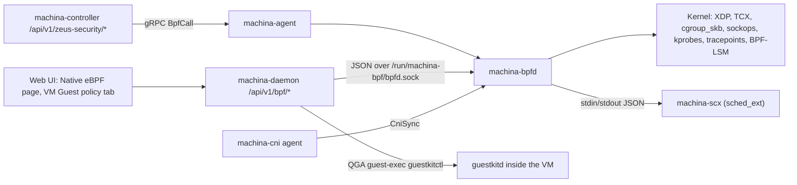

# Native eBPF in Machina

Machina ships its own eBPF datapath. One root service, **`machina-bpfd`**, loads
pure-Rust ([Aya](https://aya-rs.dev)) kernel programs and exposes them to the
daemon, the controller and the UI. It replaces separate Cilium, Tetragon, Netra
and PacketWolf agents; Machina no longer integrates with any of them.

| Page | Covers |
|---|---|
| [datapath.md](datapath.md) | Uplink XDP dispatcher, service load balancing, DDoS shield, node isolation, TCP/ICMP health, TLS fingerprints |
| [enforcement.md](enforcement.md) | Policy kinds and the enforcement lease, VM edge, QEMU sandbox, VMM guard (BPF-LSM), direct tap redirect |
| [vm-network-policy.md](vm-network-policy.md) | VM-to-VM ingress/egress policy in the CiliumNetworkPolicy schema: L3/L4, toFQDNs, L7 (HTTP, gRPC, Kafka, TLS SNI, DNS), TLS interception and header rewrites, CIDR groups, authentication (mTLS between hosts). VM labels, policy trace, packet flows (`machinactl netpol` / `flow`), flow history (map, learn, replay, L7 metrics), quarantine, just-in-time access, lateral-movement alerts, DNS threat feeds, plain-English policies, project isolation, egress allowlists and egress IPs (added and announced by bpfd), WireGuard cross-host overlay, agentless VM addresses, segmentation evidence |
| [observability.md](observability.md) | Flows, DNS, L7, accounting, captures, network-change audit, sampled L7, VM runtime intelligence |
| [fastpath.md](fastpath.md) | QUIC-LB, AF_XDP, sched_ext VM scheduler (`machina-scx`) |
| [blackbox.md](blackbox.md), [blackbox-native.md](blackbox-native.md), [blackbox-rca.md](blackbox-rca.md) | Black Box: a script that builds one VM's incident timeline from existing telemetry, the in-bpfd flight recorder (rolling buffer, freeze on trigger), and the controller's ranked root-cause report |
| [noisy-neighbor.md](noisy-neighbor.md) | Directed VM-to-VM interference graph (`aggressor -> victim`); recommends only |
| [cni.md](cni.md) | `machina-cni`: Kubernetes CNI, NetworkPolicy and Cilium policy compile, services |
| [guest-policy.md](guest-policy.md) | Per-container eBPF policy inside guests via GuestKit |

## Architecture



| Crate | Role |
|---|---|
| `bpf/machina-bpf-ebpf` | Kernel programs (`bpfel-unknown-none`, nightly `-Z build-std=core`) |
| `bpf/machina-bpf-common` | Map keys/values and event structs shared by kernel and user space |
| `bpf/machina-bpf` | Loader, policy compiler, the `machina-bpfd` service and `BpfdClient` |
| `bpf/machina-cni` | Kubernetes CNI plugin + `machina-cni agent` |
| `bpf/machina-scx` | sched_ext struct_ops scheduler (C + libbpf-rs), supervised by bpfd |

- `machina-bpfd` runs as root (`contrib/machina-bpfd.service`) and speaks
  newline-delimited JSON on `/run/machina-bpf/bpfd.sock` (`MACHINA_BPFD_SOCK`).
- The daemon exposes it at `/api/v1/bpf/*` (`daemon/src/routes/bpf.rs`); every
  `PUT` is admin-only.
- The controller (`controller/src/engine/bpf/`) fans calls out to every host
  through the agent's `BpfCall` / `BpfSyncPolicies` gRPC and backs
  `/api/v1/zeus-security/*`, SOC ingest (`machina.bpf`), the network canvas and
  AI root-cause.
- All uplink XDP features share one dispatcher, `mn_xdp_uplink`, with feature
  bits and tail calls (node isolation first, then shield, QUIC-LB, NodePort).
  One uplink per host.

## Kernel requirements

`GET /api/v1/bpf/status` reports what the running kernel supports in
`features`; the Native eBPF overview shows the same pills.

| `features` field | Needed for | Typical minimum |
|---|---|---|
| `btf` | Everything that reads kernel structs (VMM guard offsets, vm-intel) | `/sys/kernel/btf/vmlinux` present (5.4+ distro kernels) |
| `tcx` | TCX attach for VM edge, node-isolation egress | 6.6 |
| `cgroup2` | cgroup_skb / sockops / device programs | unified cgroup v2 hierarchy |
| `fentry` | fentry-based hooks | BTF + 5.5 |
| `lsm_bpf` | VMM guard **enforce** | `bpf` listed in `/sys/kernel/security/lsm` (boot with `lsm=...,bpf`) |
| `sched_ext`, `sched_ext_state` | `machina-scx` scheduler | 6.12 with `CONFIG_SCHED_CLASS_EXT` |
| `xsk` | AF_XDP | `CONFIG_XDP_SOCKETS` |

`programs_compiled: false` in the status means the build had no nightly
toolchain / `bpf-linker` and staged an empty object: run `make bpf-deps` and
rebuild.

## Safety model

Every feature that can drop or redirect traffic follows the same rules:

1. **Observe or audit by default.** Misses are counted (`observed`, `audited`),
   not dropped.
2. **Enforcement needs a lease.** `enforce` requires a lease
   (`MACHINA_BPF_ENFORCE_LEASE_SECS`, default 900 s). The deadline is checked
   **in the datapath**, so drops stop on time even if bpfd stalls.
3. **Nothing is persisted.** Mode and leases live in memory; a bpfd restart
   comes back in observe.
4. **Guards on dangerous targets.** Auto-attach only matches `vnet*` / `tap*`;
   default-deny (`tc_allow`) is never attached to an uplink; node isolation
   refuses to arm without SSH allowlisted or an exempt CIDR; direct redirect
   refuses a physical NIC without `force`; AF_XDP refuses the default-route
   interface.
5. **Separate leases where it matters.** Node isolation (10–900 s), the VMM
   guard and the scheduler (1–3600 s) carry their own leases.

Test enforcement only on veths and network namespaces, never on a host's real
uplink or production VM taps.

## API map (daemon)

| Area | Routes |
|---|---|
| Core | `/bpf/status`, `/bpf/policies`, `/bpf/mode`, `/bpf/interfaces`, `/bpf/telemetry`, `/bpf/stream` (SSE) |
| Visibility | `/bpf/flows`, `/bpf/events`, `/bpf/dns`, `/bpf/l7`, `/bpf/accounting`, `/bpf/processes`, `/bpf/anomalies`, `/bpf/health`, `/bpf/icmp-errors`, `/bpf/captures` |
| Datapath | `/bpf/cni`, `/bpf/cni/services`, `/bpf/shield`, `/bpf/node-iso`, `/bpf/tls`, `/bpf/tls/fingerprints`, `/bpf/tls/ssl`, `/bpf/qos` |
| VMs | `/bpf/vm-edge`, `/bpf/vm-sandbox`, `/bpf/guard`, `/bpf/guard/events`, `/bpf/direct`, `/bpf/vm-intel`, `/bpf/vm-intel/vms/{name}` |
| Wave 2 | `/bpf/rtnl`, `/bpf/rtnl/events`, `/bpf/l7-sample`, `/bpf/quic-lb`, `/bpf/afxdp`, `/bpf/scx` |
| Guests | `/vms/{name}/guest-policy`, `/vms/{name}/guest-lsm` |
| VM network policy | `/vm-network-policies` (+ `/validate`, `/trace`, `/endpoints`, `/selectors`, `/status`, `/fqdn-cache`, `/auth`, `/learn`, `/replay`, `/draft`, `/quarantines`, `/jit`, `/threat-feeds`, `/evidence`, `/{name}`), `/flows`, `/flows/edges`, `/flows/alerts`, `/flows/stream` (SSE), `/vms/{name}/labels` |

The controller serves the same `/api/v1/vm-network-policies` routes for the
fleet, plus `/projects`, `/projects/{project}`, `/egress-ips`, `/overlay`,
`/sync`, `/draft/propose` and `/{name}/enabled`.

Controller fleet views: `GET /api/v1/zeus-security/native-dataplane`,
`/zeus-security/tls/fingerprints`, `/zeus-security/icmp-errors`; per-host
changes go through `POST /api/v1/zeus-security/hosts/{id}/bpf` (admin).

## Build and test

```bash
make bpf-deps                      # nightly + rust-src + prebuilt bpf-linker
make release                       # builds machina-bpfd with the kernel object
cargo build --release -p machina-scx --features scx   # needs clang, bpftool, libelf-dev
```

All smokes run as root against a private bpfd on veths / netns / scratch
cgroups (Linux host only):

| Script | Covers | Checks (last run) |
|---|---|---|
| `scripts/bpf/netns-smoke.sh` (`make bpf-test`) | Policies, capture, QoS, rate limit, L7, accounting, DNS deny, shield, node isolation, direct redirect | 112 |
| `scripts/bpf/cni-smoke.sh` (`make bpf-cni-test`) | CNI routing, NetworkPolicy, socket-LB and NodePort services | 40 |
| `scripts/bpf/vm-edge-smoke.sh` | VM edge, VM network policy (identity rules, deny, ranges, ICMP, CIDR, toFQDNs, L7 HTTP/TLS/Kafka/DNS, authentication, source guard, flows, quarantine, egress SNAT and managed egress addresses, learned addresses, WireGuard overlay, node addresses as host), QEMU sandbox | 145 |
| `scripts/bpf/vm-netpol-realvm.sh` | VM network policy on two disposable real VMs: observe and leased enforce, L7, flows, history, quarantine, JIT, project isolation, preview and second-admin approval, egress allowlist, IPv4 and IPv6 egress IPs, learned addresses, overlay enable/disable, signed and per-project evidence (needs a running daemon and controller) | 187 |
| `scripts/bpf/vmintel-smoke.sh` | VM runtime intelligence | 14 |
| `scripts/bpf/guard-smoke.sh` | VMM guard | 12 |
| `scripts/bpf/quiclb-smoke.sh` | QUIC-LB | 18 |
| `scripts/bpf/afxdp-smoke.sh` | AF_XDP | 17 |
| `scripts/bpf/scx-smoke.sh` | sched_ext scheduler | 21 |
| `../guestkit/scripts/ebpf-policy-smoke.sh` | Guest per-container policy | 34 |

```bash
sudo ./scripts/bpf/netns-smoke.sh ./target/release/machina-bpfd
sudo ./scripts/bpf/scx-smoke.sh ./target/release/machina-bpfd ./target/release/machina-scx
sudo ./scripts/bpf/cni-smoke.sh ./target/release
```

Troubleshooting: see [handbook/troubleshooting.md](../handbook/troubleshooting.md#native-ebpf).
