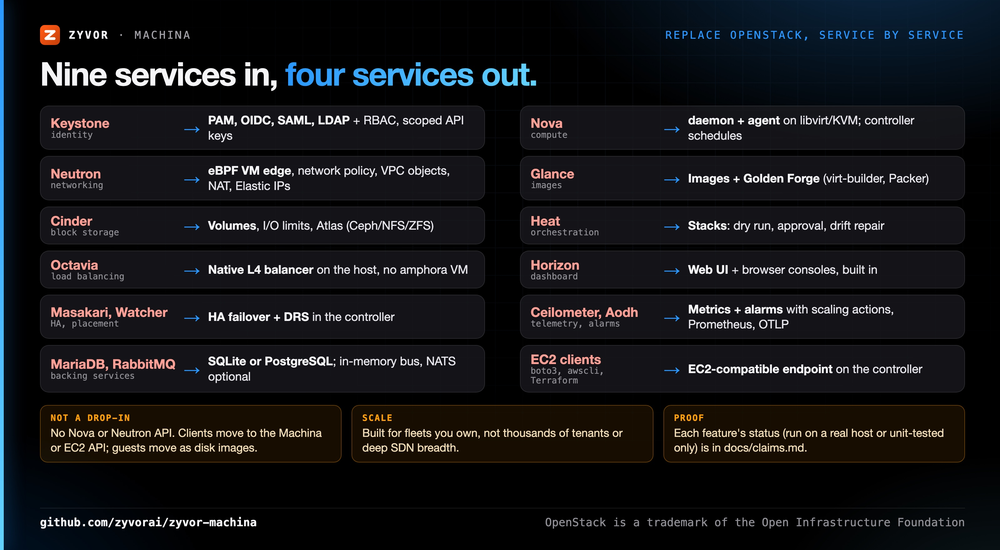

# Replacing OpenStack with Machina

Machina covers the private-cloud primitives a typical OpenStack deployment provides, with four Rust services instead of nine
or more plus Galera, RabbitMQ and Memcached. It is **not a drop-in**: there is no Nova or Neutron API, so clients and
automation move to Machina's REST API or its [EC2-compatible API](../cloud-ec2-api.md), and guests move as disk images.

## Service map

| OpenStack | Machina | Notes |
|---|---|---|
| Keystone (identity) | PAM, OIDC, SAML, LDAP, RBAC, project-scoped API keys | See [LDAP](../ldap-auth.md) and [scoped API keys](../guides/scoped-api-keys.md). No Keystone API. |
| Nova (compute) | `machina-daemon` + `machina-agent` on libvirt/KVM; the controller schedules | Flavors are instance types. Live migration, HA failover and DRS are built in. |
| Neutron (networking) | Native eBPF VM edge and network policy, VPC objects, NAT, Elastic IPs | VPC routing and peering are stored plans on a host-local backend: see [cloud-vpc-elastic-compute.md](../cloud-vpc-elastic-compute.md). No VXLAN/OVN tenant overlay; a WireGuard overlay joins hosts. |
| Glance (images) | Images and templates, Golden Forge builds (virt-builder, Packer) | [Volumes and images](../guides/volumes-and-images.md) |
| Cinder (block storage) | Volumes with I/O limits and snapshots; Atlas for Ceph, NFS or ZFS | [Atlas](../atlas-storage.md) |
| Heat (orchestration) | Stacks with dry run, approval and drift repair | [Fleet Cloud features](../fleet-cloud-features.md#stacks-you-describe). Templates are not HOT. |
| Octavia (load balancing) | Native layer-4 balancer on the host, no amphora VM | `controller/src/engine/load_balancer.rs`; also reachable through the ELBv2 actions. |
| Horizon (dashboard) | The web UI, with browser consoles | No separate console proxy. |
| Masakari, Watcher | HA failover and DRS in the controller | [controller-ha.md](../controller-ha.md), [fleet-ha.md](../fleet-ha.md) |
| Ceilometer, Aodh | Metrics history, alarms with scaling actions, Prometheus and OTLP | [Alarms and scaling](../guides/alarms-and-scaling.md) |
| MariaDB/Galera, RabbitMQ | SQLite or PostgreSQL; in-memory task bus, NATS optional | [Database guide](../guides/database.md) |
| Magnum, Zun | KubeVirt, Podman and Docker (Vessel), `machina-cni` | Opt-in. |

## Concept map

| OpenStack | Machina / EC2 API |
|---|---|
| Project (tenant) | Fleet Cloud project; isolated from other projects by default |
| Flavor | Instance type |
| Security group | Security group, enforced on the host datapath |
| Floating IP | Elastic IP and NAT gateway (EC2 `AllocateAddress`) |
| Keypair | Key pair, injected at first boot |
| Server group | Server group |
| Heat stack | Stack |
| Cloud-init user data | User data, same format |

## Moving a workload

1. Inventory what you use. Anything on the "gaps" list below that you depend on decides whether Machina fits.
2. Stand up Machina next to OpenStack on spare hosts: `./machinactl deploy`, then add hosts ([Quickstart](../QUICKSTART.md)).
3. Re-create the shapes (projects, instance types, security groups, networks) through the web UI, the REST API, or Terraform's
   `aws` provider against the [EC2 endpoint](../cloud-ec2-clients.md).
4. Move each guest as a disk image: export it from OpenStack (`openstack image save`, or create an image from the volume) in
   qcow2 or raw, bring it in as a Machina image or volume, and launch from it. Machina has **no OpenStack importer**, and this
   disk-image path has not been run end to end on a real OpenStack cloud.
5. Cut traffic over (DNS or load balancer), then drain the old hosts and add them to Machina.

## Gaps

- Thousands of tenants, and Neutron-grade SDN breadth (provider networks, VXLAN/OVN, BGP, QoS policies) are out of scope.
- No Nova, Neutron, Cinder or Keystone API, so tools such as `python-openstackclient` or Terraform's `openstack` provider do not work.
- The OpenStack ecosystem (Trove, Sahara, Manila and so on) has no counterpart.
- What has been run on a real host and what is unit-tested only is recorded in [claims.md](../claims.md).

Choose OpenStack when you run thousands of tenants, need its SDN breadth, or depend on its ecosystem. Machina targets fleets you
own: a lab, a branch, a sovereign region, a VMware exit.
